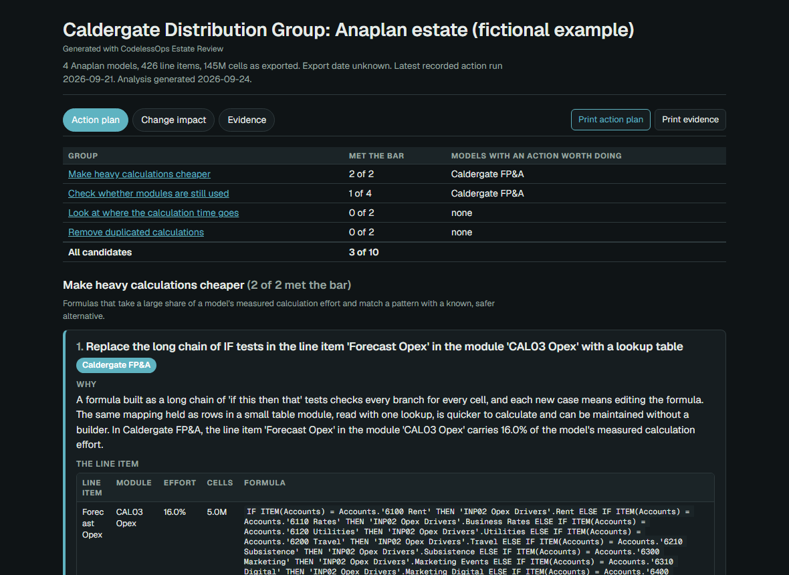

# Case study: reviewing an inherited Anaplan estate

**Author:** Karim Lameer — CIMA-qualified accountant, Master Anaplanner.
**Scope:** an open-source analysis tool with a fictional example estate and
limited private development evidence. Independent product validation is pending.

## The problem

A model owner needs to decide what to investigate and what a proposed
change might affect. An estate can contain duplicated logic, old imports,
long dependency chains and modules whose purpose is unclear. A large list
of warnings does not explain which decision to take next.

This project turns standard exports into a review: candidate actions,
upstream/downstream dependencies, and the evidence behind each finding.

## My contribution

I designed and built the export-to-report workflow, estate analysis,
evidence-labelled recommendations, impact explorer and hosted upload
service. The formula parser and graph foundation are my separate
[anaplan-grammar](https://github.com/klameer/anaplan-grammar) project.

The implementation, fictional fixture and tests are public. The framework
and library dependencies are listed in [pyproject.toml](pyproject.toml).
The project does not contain client exports.

## Decisions and their consequences

| Decision | Benefit | Consequence |
| --- | --- | --- |
| Analyse exported snapshots | Works locally without Anaplan credentials; the inputs can be inspected. | Cannot observe live usage, all consumers or every dependency. Snapshot freshness matters. |
| Parse formulas before building the graph | Resolves references using formula structure and module context. | Parser coverage and missing exports constrain completeness. |
| Separate observations, hypotheses and recommendations | A reviewer can see why a finding exists and how much to trust it. | Useful recommendations still require business context and independent validation. |
| Deliver one offline report | The owner can inspect and retain the results without a running service. | Large estates create large pages; the implementation limits expensive indexing. |

## Inspect the result in five minutes

1. Open the [upload page](https://anaplan-estate.codelessops.com) and use its
   fictional example, or follow the local example in [README](README.md).
2. Open an action and inspect its named objects, evidence and completion check.
3. Follow its Change impact link and inspect one path to a downstream item.
4. Read [what was planted](examples/caldergate-estate/PLANTED.md) in the
   fictional estate and compare it with the report.
5. Read [VALIDATION.md](VALIDATION.md) before drawing a conclusion about
   recommendation quality or savings.

## Evidence a technical reviewer can reproduce

- [Input tests](tests/test_inputs.py): missing columns and export variations.
- [Impact tests](tests/test_plan_impact.py): traversal, cycles, shared paths,
  agreement between Python and browser logic, and consistent output counts.
- [Rule tests](tests/test_rules.py): findings on controlled fixtures.
- [CI](https://github.com/klameer/anaplan-estate/actions/workflows/test.yml):
  Python 3.10–3.13, with a generated example report attached as an artifact.

The tests establish implementation behaviour. Development on one private
estate and a fictional estate does not establish generalisation, actual
savings or the best action order. The [review guide](docs/REVIEW_GUIDE.md)
turns the next validation step into a bounded exercise for an independent reviewer.

## What I would discuss in an interview

Why a large dependency footprint is not a saving; how incomplete exports
change the advice; why graph agreement is checked against Referenced By;
and how to test a recommendation before making a production change.
