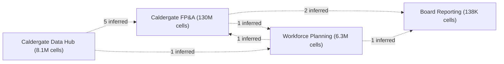

# Anaplan estate: 4 models

Automated findings and candidate recommendations from each model's Line Items, Modules and Actions exports. Generated 2026-09-22.

## Summary

4 Anaplan models, 426 line items, 145M cells as exported. Export date unknown. Latest recorded action run: 2026-09-21. Analysis generated 2026-09-22. Read from the exports only; pages, saved views and subsets are not in them, so 'no consumer detected' is a question, not a saving.

The investigations below were chosen for footprint and evidence strength and can proceed independently. Reference findings are hidden until asked for.

**Observations**

1. Caldergate FP&A holds 90% of the estate's 145M exported cells; CAL05 Opex OLD alone holds 70.2M.
2. Ten line items carry 68.0% of Caldergate FP&A's measured calculation effort (per model; the engine is not in the export).
3. Caldergate Data Hub feeds Caldergate FP&A, Workforce Planning through 6 import actions; all 6 feeds are inferred from action names.

**Priority investigations**

1. **Investigate Caldergate Data Hub's principal calculation hotspots.** Ten line items carry 99.9% of Caldergate Data Hub's measured calculation effort, led by DAT01 GL Transactions.Loaded? at 88.3%. Who: model builder who owns Caldergate Data Hub. Next: Read the formulas of the top five and match each against the findings that name it; choose one to trial in a development copy. Findings: [F3](#F3).
2. **Establish whether the large modules nothing reads remain necessary.** 7 modules across 4 models hold 70.3M cells with no formula or export consumer in the exports; each needs a consumer check before any keep-or-retire decision. Who: model owner with a page builder. Next: Complete the consumer and retention checks for the largest modules in each model, then record a keep-or-retire recommendation per module. Findings: [F1](#F1), [F30](#F30), [F31](#F31), [F8](#F8).
   - Caldergate FP&A: 3 modules, 70.3M cells, 50.8% effort; largest `CAL05 Opex OLD`, `CAL06 Department Summary` ([F1](#F1))
   - Workforce Planning: 1 modules, 13.4K cells; largest `zz Archive - 2021 Cost` ([F30](#F30))
   - Caldergate Data Hub: 2 modules, 360 cells, 0.0% effort; largest `SYS01 Time Settings`, `SYS02 Data Checks` ([F31](#F31))
   - Board Reporting: 1 modules, 72 cells, 2.8% effort; largest `SYS01 Time` ([F8](#F8))
3. **Validate one substantial duplicate-calculation group.** In Caldergate FP&A, 1 group; 1 duplicate line item plus one kept line item per group; the largest group repeats CAL07 P&L by Cost Centre.Depreciation 1 more time (19.2K cells). Who: model builder who owns Caldergate FP&A. Next: Validate equivalence and the reasons for separate objects in that group, then decide whether consolidation is appropriate. Findings: [F11](#F11).

4 models reviewed · 8 findings to review first · 32 additional reference findings. No finding is a validated defect; all are observations or review candidates.

**Coverage limitations**

- Pages, saved views, line item subsets, filters, access drivers and integrations are not in any export; each 'no consumer detected' finding lists the checks that remain.
- Export date unknown for every file; the latest recorded action run is not an export date.

**Model map (feeds inferred from import action names)**

Have a change planned in this estate? Request a review of one proposed change: the dependencies visible in your exports, what still needs checking, and a validation plan with your model owner. (Request route not configured in this report.)

Illustrative example (from the exports; no further analysis has been run):

- Proposed change: Change the formula of SYS01 Time Settings.Actual? in Caldergate FP&A.
- Dependency evidence examined: 36 formulas read it directly and 101 line items across 13 modules depend on it transitively (parsed references, checked against Referenced By at 100% agreement); 2 export actions read those modules; Caldergate FP&A feeds Board Reporting, Workforce Planning by inferred import actions.
- Additional context required: Pages and saved views that show any of the dependent line items; line item subsets that include them; whether the exports feed another model's import; the owner's acceptance criteria for the outputs.
- Validation plan that would result: Compare the dependent outputs the owner names between a development copy and production before and after the change; reconcile the exports read by other models; sign-off by the model owner before promotion.

# Findings

## Potential capacity or performance improvements

Where cells and measured calculation effort concentrate, and what could be released if an investigation confirms it.

### F3. Where measured calculation effort concentrates

Caldergate Data Hub · observation · importance medium · evidence confirmed · complexity medium

Examples: `DAT01 GL Transactions.Loaded?`, `CAL01 Volume Summary.Units`, `CAL01 Volume Summary.Revenue` and 7 more (top 20 line items by effort share)

**Observed.** Ten line items carry 99.9% of Caldergate Data Hub's measured calculation effort, led by `DAT01 GL Transactions.Loaded?` at 88.3%; a concentration to investigate, not a saving.

**Why it matters.** Effort is where a redesign would show. Effort shares are Anaplan's Calculation Effort column for this model only. The engine is not in the export: Classic measures across the whole model at open, Polaris over the last ten minutes. A share of effort is not a promise of faster recalculation after removal.

**Next investigation step.** Read the formulas of the top five and match each against the other findings that name it (SUM with LOOKUP, IF chains, text in large modules); decide which one to trial in a development copy first.

Full assessment and affected objects

**Observed, in full.** Ten line items carry 99.9% of Caldergate Data Hub's measured calculation effort; the largest is `DAT01 GL Transactions.Loaded?` at 88.3%.

**Affected scope.** top 20 line items by effort

**Potential benefit.** Observed footprint only; no reduction is claimed. (footprint)

**Evidence strength.** confirmed: Anaplan's Calculation Effort column as exported.

**Missing information.**

- engine (Classic or Polaris)
- when the measurement was taken

**When keeping the current design is reasonable.** High effort in the line item that does the model's main job is expected.

**All affected objects.** `DAT01 GL Transactions.Loaded?`, `CAL01 Volume Summary.Units`, `CAL01 Volume Summary.Revenue`, `CAL01 Volume Summary.Orders`, `DAT05 CRM Pipeline.Weighted Pipeline`, `CAL01 Volume Summary.Average Order Value`, `DAT08 Employee Master.Employee Id`, `DAT03 Account Master.Sign`, `DAT07 Customer Master.Region Code`, `DAT03 Account Master.Revenue?`

**Evidence**

| Line item | Effort share | Cells | Formula |
|---|---|---|---|
| `DAT01 GL Transactions.Loaded?` | 88.35% | 1.3M | `Journal Count > 0` |
| `CAL01 Volume Summary.Units` | 2.88% | 9.1K | `'DAT06 Sales Orders'.Units[SUM: 'DAT07 Customer Master'.Region]` |
| `CAL01 Volume Summary.Revenue` | 2.88% | 9.1K | `'DAT06 Sales Orders'.Order Revenue[SUM: 'DAT07 Customer Master'.Region]` |
| `CAL01 Volume Summary.Orders` | 2.88% | 9.1K | `'DAT06 Sales Orders'.Order Count[SUM: 'DAT07 Customer Master'.Region]` |
| `DAT05 CRM Pipeline.Weighted Pipeline` | 1.83% | 17.3K | `Open Pipeline * Probability` |
| `CAL01 Volume Summary.Average Order Value` | 0.96% | 9.1K | `DIVIDE(Revenue, Orders)` |
| `DAT08 Employee Master.Employee Id` | 0.07% | 1.9K | `CODE(ITEM(Employees))` |
| `DAT03 Account Master.Sign` | 0.03% | 262 | `IF Revenue? THEN -1 ELSE 1` |
| `DAT07 Customer Master.Region Code` | 0.03% | 480 | `CODE(Region)` |
| `DAT03 Account Master.Revenue?` | 0.02% | 262 | `Account Type = Account Types.Revenue` |
| `DAT03 Account Master.Opex?` | 0.02% | 262 | `Account Type = Account Types.Opex` |
| `DAT03 Account Master.COGS?` | 0.02% | 262 | `Account Type = Account Types.COGS` |
| `DAT07 Customer Master.Customer Code` | 0.02% | 480 | `CODE(ITEM(Customers))` |
| `DAT03 Account Master.Account Code` | 0.01% | 262 | `CODE(ITEM(Accounts))` |
| `SYS02 Data Checks.Check Message` | 0.01% | 36 | `IF Within Tolerance? THEN "OK" ELSE "GL and orders differ by " & TEXT(Difference)` |

By module: `DAT01 GL Transactions` 88.3%, `CAL01 Volume Summary` 9.6%, `DAT05 CRM Pipeline` 1.8%, `DAT03 Account Master` 0.1%, `DAT08 Employee Master` 0.1%, `DAT07 Customer Master` 0.1%, `SYS02 Data Checks` 0.0%

### F5. Where measured calculation effort concentrates

Caldergate FP&A · observation · importance medium · evidence confirmed · complexity medium

Examples: `CAL03 Opex.Forecast Opex`, `CAL03 Opex.Opex GBP`, `CAL05 Opex OLD.Opex GBP` and 7 more (top 20 line items by effort share)

**Observed.** Ten line items carry 68.0% of Caldergate FP&A's measured calculation effort, led by `CAL03 Opex.Forecast Opex` at 16.0%; a concentration to investigate, not a saving.

**Why it matters.** Effort is where a redesign would show. Effort shares are Anaplan's Calculation Effort column for this model only. The engine is not in the export: Classic measures across the whole model at open, Polaris over the last ten minutes. A share of effort is not a promise of faster recalculation after removal.

**Next investigation step.** Read the formulas of the top five and match each against the other findings that name it (SUM with LOOKUP, IF chains, text in large modules); decide which one to trial in a development copy first.

Full assessment and affected objects

**Observed, in full.** Ten line items carry 68.0% of Caldergate FP&A's measured calculation effort; the largest is `CAL03 Opex.Forecast Opex` at 16.0%.

**Affected scope.** top 20 line items by effort

**Potential benefit.** Observed footprint only; no reduction is claimed. (footprint)

**Evidence strength.** confirmed: Anaplan's Calculation Effort column as exported.

**Missing information.**

- engine (Classic or Polaris)
- when the measurement was taken

**When keeping the current design is reasonable.** High effort in the line item that does the model's main job is expected.

**All affected objects.** `CAL03 Opex.Forecast Opex`, `CAL03 Opex.Opex GBP`, `CAL05 Opex OLD.Opex GBP`, `CAL05 Opex OLD.Forecast`, `DAT01 Actuals GL.Journal Cost Centre`, `CAL03 Opex.Opex`, `CAL05 Opex OLD.Opex`, `CAL03 Opex.Actual Opex`, `CAL05 Opex OLD.Actual`, `CAL05 Opex OLD.Opex Cumulative`

**Evidence**

| Line item | Effort share | Cells | Formula |
|---|---|---|---|
| `CAL03 Opex.Forecast Opex` | 16.04% | 5.0M | `IF ITEM(Accounts) = Accounts.'6100 Rent' THEN 'INP02 Opex Drivers'.Rent ELSE IF ITEM(Accounts) = Accounts.'6110 Rates' THEN 'INP02 Opex Drivers'.Business Rates ELSE IF ITEM(Accounts) = Accounts.'6120 Utilities' THEN 'INP02 Opex Drivers'.Utilities ELSE IF ITEM(Accounts) = Accounts.'6200 Travel' THEN 'INP02 Opex Drivers'.Travel ELSE IF ITEM(Accounts) = Accounts.'6210 Subsistence' THEN 'INP02 Opex Drivers'.Subsistence ELSE IF ITEM(Accounts) = Accounts.'6300 Marketing' THEN 'INP02 Opex Drivers'.Marketing Events ELSE IF ITEM(Accounts) = Accounts.'6310 Digital' THEN 'INP02 Opex Drivers'.Marketing Digital ELSE IF ITEM(Accounts) = Accounts.'6400 Software' THEN 'INP02 Opex Drivers'.Software Licences ELSE IF ITEM(Accounts) = Accounts.'6410 Hardware' THEN 'INP02 Opex Drivers'.Hardware ELSE IF ITEM(Accounts) = Accounts.'6500 Professional Fees' THEN 'INP02 Opex Drivers'.Consultancy ELSE IF ITEM(Accounts) = Accounts.'6510 Audit' THEN 'INP02 Opex Drivers'.Audit Fees ELSE IF ITEM(Accounts) = Accounts.'6600 Recruitment' THEN 'INP02 Opex Drivers'.Recruitment Fees ELSE 0` |
| `CAL03 Opex.Opex GBP` | 9.26% | 5.0M | `Opex * 'SYS05 FX Rates'.Rate to GBP[LOOKUP: 'SYS02 Cost Centre Attributes'.Currency]` |
| `CAL05 Opex OLD.Opex GBP` | 9.26% | 5.0M | `Opex * 'SYS05 FX Rates'.Rate to GBP[LOOKUP: 'SYS02 Cost Centre Attributes'.Currency]` |
| `CAL05 Opex OLD.Forecast` | 6.94% | 5.0M | `Rent Forecast + Rates Forecast + Utilities Forecast + Travel Forecast + Marketing Forecast + Software Forecast + Fees Forecast + Other Forecast` |
| `DAT01 Actuals GL.Journal Cost Centre` | 6.17% | 5.0M | `FINDITEM(Cost Centres, Source Journal)` |
| `CAL03 Opex.Opex` | 4.94% | 5.0M | `IF 'SYS01 Time Settings'.Actual? THEN Actual Opex ELSE Forecast Opex` |
| `CAL05 Opex OLD.Opex` | 4.94% | 5.0M | `IF 'SYS01 Time Settings'.Actual? THEN Actual ELSE Forecast` |
| `CAL03 Opex.Actual Opex` | 3.70% | 5.0M | `IF 'SYS03 Account Attributes'.Opex? THEN 'DAT01 Actuals GL'.Amount ELSE 0` |
| `CAL05 Opex OLD.Actual` | 3.70% | 5.0M | `IF 'SYS01 Time Settings'.Actual? THEN 'DAT01 Actuals GL'.Amount ELSE 0` |
| `CAL05 Opex OLD.Opex Cumulative` | 3.09% | 5.0M | `CUMULATE(Opex GBP)` |
| `CAL05 Opex OLD.Opex Run Rate` | 3.09% | 5.0M | `MOVINGSUM(Opex GBP, -2, 0) / 3` |
| `CAL05 Opex OLD.Rent Forecast` | 2.47% | 5.0M | `IF ITEM(Accounts) = Accounts.'6100 Rent' THEN 'INP02 Opex Drivers'.Rent ELSE 0` |
| `CAL05 Opex OLD.Rates Forecast` | 2.47% | 5.0M | `IF ITEM(Accounts) = Accounts.'6110 Rates' THEN 'INP02 Opex Drivers'.Business Rates ELSE 0` |
| `CAL05 Opex OLD.Utilities Forecast` | 2.47% | 5.0M | `IF ITEM(Accounts) = Accounts.'6120 Utilities' THEN 'INP02 Opex Drivers'.Utilities ELSE 0` |
| `CAL05 Opex OLD.Travel Forecast` | 2.47% | 5.0M | `IF ITEM(Accounts) = Accounts.'6200 Travel' THEN 'INP02 Opex Drivers'.Travel ELSE 0` |
| `CAL05 Opex OLD.Marketing Forecast` | 2.47% | 5.0M | `IF ITEM(Accounts) = Accounts.'6300 Marketing' THEN 'INP02 Opex Drivers'.Marketing Events ELSE 0` |
| `CAL05 Opex OLD.Software Forecast` | 2.47% | 5.0M | `IF ITEM(Accounts) = Accounts.'6400 Software' THEN 'INP02 Opex Drivers'.Software Licences ELSE 0` |
| `CAL05 Opex OLD.Fees Forecast` | 2.47% | 5.0M | `IF ITEM(Accounts) = Accounts.'6500 Professional Fees' THEN 'INP02 Opex Drivers'.Consultancy ELSE 0` |
| `CAL05 Opex OLD.Other Forecast` | 2.47% | 5.0M | `IF ITEM(Accounts) = Accounts.'6900 Other' THEN 'INP02 Opex Drivers'.Other Opex ELSE 0` |
| `CAL03 Opex.Opex Variance` | 2.31% | 5.0M | `Opex GBP - Opex Prior Year` |

By module: `CAL05 Opex OLD` 50.8%, `CAL03 Opex` 37.8%, `DAT01 Actuals GL` 7.7%, `INP03 Headcount` 2.1%, `CAL12 Driver Phasing` 0.4%, `INP02 Opex Drivers` 0.3%, `CAL02 Revenue` 0.2%, `CAL01 Volumes` 0.1%, `CAL07 P&L by Cost Centre` 0.1%, `CAL04 Margn` 0.1%

### F6. Where measured calculation effort concentrates

Board Reporting · observation · importance medium · evidence confirmed · complexity medium

Examples: `CAL01 KPIs.Revenue per FTE`, `CAL01 KPIs.Opex Ratio`, `CAL01 KPIs.Revenue Growth` and 7 more (top 20 line items by effort share)

**Observed.** Ten line items carry 89.7% of Board Reporting's measured calculation effort, led by `CAL01 KPIs.Revenue per FTE` at 11.2%; a concentration to investigate, not a saving.

**Why it matters.** Effort is where a redesign would show. Effort shares are Anaplan's Calculation Effort column for this model only. The engine is not in the export: Classic measures across the whole model at open, Polaris over the last ten minutes. A share of effort is not a promise of faster recalculation after removal.

**Next investigation step.** Read the formulas of the top five and match each against the other findings that name it (SUM with LOOKUP, IF chains, text in large modules); decide which one to trial in a development copy first.

Full assessment and affected objects

**Observed, in full.** Ten line items carry 89.7% of Board Reporting's measured calculation effort; the largest is `CAL01 KPIs.Revenue per FTE` at 11.2%.

**Affected scope.** top 20 line items by effort

**Potential benefit.** Observed footprint only; no reduction is claimed. (footprint)

**Evidence strength.** confirmed: Anaplan's Calculation Effort column as exported.

**Missing information.**

- engine (Classic or Polaris)
- when the measurement was taken

**When keeping the current design is reasonable.** High effort in the line item that does the model's main job is expected.

**All affected objects.** `CAL01 KPIs.Revenue per FTE`, `CAL01 KPIs.Opex Ratio`, `CAL01 KPIs.Revenue Growth`, `CAL01 KPIs.EBITDA Margin`, `CAL01 KPIs.FTE`, `CAL01 KPIs.Revenue Prior Year`, `CAL01 KPIs.Revenue YTD`, `OUT01 Board Dashboard.Revenue`, `OUT01 Board Dashboard.EBITDA`, `OUT01 Board Dashboard.Revenue per FTE`

**Evidence**

| Line item | Effort share | Cells | Formula |
|---|---|---|---|
| `CAL01 KPIs.Revenue per FTE` | 11.21% | 144 | `'DAT02 Board Lines'.Revenue / FTE` |
| `CAL01 KPIs.Opex Ratio` | 11.21% | 144 | `DIVIDE('DAT01 P&L'.Opex, 'DAT01 P&L'.Revenue)` |
| `CAL01 KPIs.Revenue Growth` | 11.21% | 144 | `DIVIDE('DAT02 Board Lines'.Revenue - Revenue Prior Year, Revenue Prior Year)` |
| `CAL01 KPIs.EBITDA Margin` | 11.21% | 144 | `DIVIDE('DAT02 Board Lines'.EBITDA, 'DAT02 Board Lines'.Revenue)` |
| `CAL01 KPIs.FTE` | 7.48% | 144 | `'DAT03 Headcount'.FTE` |
| `CAL01 KPIs.Revenue Prior Year` | 7.48% | 144 | `LAG('DAT02 Board Lines'.Revenue, 12, 0)` |
| `CAL01 KPIs.Revenue YTD` | 7.48% | 144 | `YEARTODATE('DAT02 Board Lines'.Revenue)` |
| `OUT01 Board Dashboard.Revenue` | 7.48% | 144 | `'DAT02 Board Lines'.Revenue` |
| `OUT01 Board Dashboard.EBITDA` | 7.48% | 144 | `'DAT02 Board Lines'.EBITDA` |
| `OUT01 Board Dashboard.Revenue per FTE` | 7.48% | 144 | `'CAL01 KPIs'.Revenue per FTE` |
| `OUT01 Board Dashboard.Revenue Growth` | 7.48% | 144 | `'CAL01 KPIs'.Revenue Growth` |
| `SYS01 Time.Current Period?` | 1.87% | 36 | `ITEM(Time) = 'SYS00 Settings'.Current Period` |
| `SYS01 Time.Period Label` | 0.93% | 36 | `NAME(ITEM(Time))` |

By module: `CAL01 KPIs` 67.3%, `OUT01 Board Dashboard` 29.9%, `SYS01 Time` 2.8%

### F13. Text, FINDITEM and per-item functions in large multi-dimensional line items

Caldergate Data Hub · review candidate · importance low · evidence confirmed · complexity low

Examples: `DAT01 GL Transactions.Source System`, `DAT06 Sales Orders.Last Order Ref` (2 objects)

**Observed.** 2 line items compute a text value, a FINDITEM, a text join or a per-item function (ITEM, PARENT, NAME, CODE) in a line item with many cells.

**Why it matters.** Computed once per cell here; computed once per list item in a one-dimension system module. Anaplan's checklist recommends the system module.

**Next investigation step.** Start with the largest by cells; compute it once in a SYS module dimensioned by the list it depends on.

Full assessment and affected objects

**Observed, in full.** 2 line items compute a text value, a FINDITEM, a text join or a per-item function (ITEM, PARENT, NAME, CODE) in a line item with many cells.

**Affected scope.** 2 line items

**Potential benefit.** Observed footprint only; improvement would be measured after the change. (footprint)

**Evidence strength.** confirmed: Parsed function calls and exported cell counts.

**Missing information.**

- measured effort after the change

**When keeping the current design is reasonable.** A small line item, or one that genuinely varies per cell, is fine where it is.

**All affected objects.** `DAT01 GL Transactions.Source System`, `DAT06 Sales Orders.Last Order Ref`

**Evidence**

| Line item | What | Cells | Effort share | Formula |
|---|---|---|---|---|
| `DAT01 GL Transactions.Source System` | Text-formatted line item | 1.3M | 0.00% | `` |
| `DAT06 Sales Orders.Last Order Ref` | Text-formatted line item | 726K | 0.00% | `` |

### F15. SUM combined with LOOKUP or SELECT in one formula

Caldergate FP&A · review candidate · importance low · evidence confirmed · complexity low

Examples: `CAL06 Department Summary.Benchmark Opex` (1 object)

**Observed.** 1 formulas combine SUM with LOOKUP or SELECT.

**Why it matters.** The documented concern is calculation time. Whether splitting a particular formula helps is not guaranteed; the documented approach is one line item to aggregate and another to look up or select from it.

**Next investigation step.** Take the formula with the largest effort share; split it in a sandbox copy; compare Calculation Effort before and after.

Full assessment and affected objects

**Observed, in full.** 1 formulas combine SUM with LOOKUP or SELECT. Anaplan's documentation: "Never use SUM and LOOKUP in the same formula. This can lead to extremely long calculation times." and "Never combine SUM and SELECT in the same formula."

**Affected scope.** 1 formula; together 0.0% of Caldergate FP&A's measured effort

**Potential benefit.** Observed: the listed effort shares. Improvement would have to be measured after the change. (footprint)

**Evidence strength.** confirmed: Parsed clause kinds per formula; official guidance quoted.

**Missing information.**

- measured effort after a trial split

**When keeping the current design is reasonable.** A formula with a small effort share that reads clearly can stay as it is; the guidance targets calculation time, not style.

**Implementation, with prerequisites.**

- Prerequisites: a development copy and a Calculation Effort reading before the change. Then split, reconcile values cell for cell, read effort again; keep the split only if it pays.

**All affected objects.** `CAL06 Department Summary.Benchmark Opex`

**Evidence**

| Line item | Combination | Effort share | Formula |
|---|---|---|---|
| `CAL06 Department Summary.Benchmark Opex` | SUM with LOOKUP in one formula (in the same bracket) | 0.00% | `'CAL03 Opex'.Opex GBP[SUM: 'SYS02 Cost Centre Attributes'.Department, LOOKUP: 'SYS09 Department Settings'.Benchmark Account]` |

### F16. Text, FINDITEM and per-item functions in large multi-dimensional line items

Caldergate FP&A · review candidate · importance low · evidence confirmed · complexity low

Examples: `DAT01 Actuals GL.Source Journal`, `DAT01 Actuals GL.Journal Cost Centre`, `CAL02 Revenue.Revenue Label` and 10 more (13 objects)

**Observed.** 13 line items compute a text value, a FINDITEM, a text join or a per-item function (ITEM, PARENT, NAME, CODE) in a line item with many cells.

**Why it matters.** Computed once per cell here; computed once per list item in a one-dimension system module. Anaplan's checklist recommends the system module.

**Next investigation step.** Start with the largest by cells; compute it once in a SYS module dimensioned by the list it depends on.

Full assessment and affected objects

**Observed, in full.** 13 line items compute a text value, a FINDITEM, a text join or a per-item function (ITEM, PARENT, NAME, CODE) in a line item with many cells.

**Affected scope.** 13 line items

**Potential benefit.** Observed footprint only; improvement would be measured after the change. (footprint)

**Evidence strength.** confirmed: Parsed function calls and exported cell counts.

**Missing information.**

- measured effort after the change

**When keeping the current design is reasonable.** A small line item, or one that genuinely varies per cell, is fine where it is.

**All affected objects.** `DAT01 Actuals GL.Source Journal`, `DAT01 Actuals GL.Journal Cost Centre`, `CAL02 Revenue.Revenue Label`, `CAL02 Revenue.Revenue Label`, `CAL03 Opex.Forecast Opex`, `CAL05 Opex OLD.Fees Forecast`, `CAL05 Opex OLD.Marketing Forecast`, `CAL05 Opex OLD.Other Forecast`, `CAL05 Opex OLD.Rates Forecast`, `CAL05 Opex OLD.Rent Forecast`, `CAL05 Opex OLD.Software Forecast`, `CAL05 Opex OLD.Travel Forecast`, `CAL05 Opex OLD.Utilities Forecast`

**Evidence**

| Line item | What | Cells | Effort share | Formula |
|---|---|---|---|---|
| `DAT01 Actuals GL.Source Journal` | Text-formatted line item | 5.0M | 0.00% | `` |
| `DAT01 Actuals GL.Journal Cost Centre` | FINDITEM in a large line item | 5.0M | 6.17% | `FINDITEM(Cost Centres, Source Journal)` |
| `CAL02 Revenue.Revenue Label` | Text concatenation in a large line item | 36.3K | 0.01% | `NAME(ITEM(Products)) & " / " & NAME(ITEM(Regions))` |
| `CAL02 Revenue.Revenue Label` | Unchanging function in a calculation module | 36.3K | 0.01% | `NAME(ITEM(Products)) & " / " & NAME(ITEM(Regions))` |
| `CAL03 Opex.Forecast Opex` | Unchanging function in a calculation module | 5.0M | 16.04% | `IF ITEM(Accounts) = Accounts.'6100 Rent' THEN 'INP02 Opex Drivers'.Rent ELSE IF ITEM(Accounts) = Accounts.'6110 Rates' THEN 'INP02 Opex Drivers'.Business Rates ELSE IF ITEM(Accounts) = Accounts.'6120 Utilities' THEN 'INP02 Opex Drivers'.Utilities ELSE IF ITEM(Accounts) = Accounts.'6200 Travel' THEN 'INP02 Opex Drivers'.Travel ELSE IF ITEM(Accounts) = Accounts.'6210 Subsistence' THEN 'INP02 Opex Drivers'.Subsistence ELSE IF ITEM(Accounts) = Accounts.'6300 Marketing' THEN 'INP02 Opex Drivers'.Marketing Events ELSE IF ITEM(Accounts) = Accounts.'6310 Digital' THEN 'INP02 Opex Drivers'.Marketing Digital ELSE IF ITEM(Accounts) = Accounts.'6400 Software' THEN 'INP02 Opex Drivers'.Software Licences ELSE IF ITEM(Accounts) = Accounts.'6410 Hardware' THEN 'INP02 Opex Drivers'.Hardware ELSE IF ITEM(Accounts) = Accounts.'6500 Professional Fees' THEN 'INP02 Opex Drivers'.Consultancy ELSE IF ITEM(Accounts) = Accounts.'6510 Audit' THEN 'INP02 Opex Drivers'.Audit Fees ELSE IF ITEM(Accounts) = Accounts.'6600 Recruitment' THEN 'INP02 Opex Drivers'.Recruitment Fees ELSE 0` |
| `CAL05 Opex OLD.Fees Forecast` | Unchanging function in a calculation module | 5.0M | 2.47% | `IF ITEM(Accounts) = Accounts.'6500 Professional Fees' THEN 'INP02 Opex Drivers'.Consultancy ELSE 0` |
| `CAL05 Opex OLD.Marketing Forecast` | Unchanging function in a calculation module | 5.0M | 2.47% | `IF ITEM(Accounts) = Accounts.'6300 Marketing' THEN 'INP02 Opex Drivers'.Marketing Events ELSE 0` |
| `CAL05 Opex OLD.Other Forecast` | Unchanging function in a calculation module | 5.0M | 2.47% | `IF ITEM(Accounts) = Accounts.'6900 Other' THEN 'INP02 Opex Drivers'.Other Opex ELSE 0` |
| `CAL05 Opex OLD.Rates Forecast` | Unchanging function in a calculation module | 5.0M | 2.47% | `IF ITEM(Accounts) = Accounts.'6110 Rates' THEN 'INP02 Opex Drivers'.Business Rates ELSE 0` |
| `CAL05 Opex OLD.Rent Forecast` | Unchanging function in a calculation module | 5.0M | 2.47% | `IF ITEM(Accounts) = Accounts.'6100 Rent' THEN 'INP02 Opex Drivers'.Rent ELSE 0` |
| `CAL05 Opex OLD.Software Forecast` | Unchanging function in a calculation module | 5.0M | 2.47% | `IF ITEM(Accounts) = Accounts.'6400 Software' THEN 'INP02 Opex Drivers'.Software Licences ELSE 0` |
| `CAL05 Opex OLD.Travel Forecast` | Unchanging function in a calculation module | 5.0M | 2.47% | `IF ITEM(Accounts) = Accounts.'6200 Travel' THEN 'INP02 Opex Drivers'.Travel ELSE 0` |
| `CAL05 Opex OLD.Utilities Forecast` | Unchanging function in a calculation module | 5.0M | 2.47% | `IF ITEM(Accounts) = Accounts.'6120 Utilities' THEN 'INP02 Opex Drivers'.Utilities ELSE 0` |

### F24. Text, FINDITEM and per-item functions in large multi-dimensional line items

Workforce Planning · review candidate · importance low · evidence confirmed · complexity low

Examples: `Data - Employees.Employee Name`, `Data - Employees.Name and Role`, `Data - Employees.Name and Role` (3 objects)

**Observed.** 3 line items compute a text value, a FINDITEM, a text join or a per-item function (ITEM, PARENT, NAME, CODE) in a line item with many cells.

**Why it matters.** Computed once per cell here; computed once per list item in a one-dimension system module. Anaplan's checklist recommends the system module.

**Next investigation step.** Start with the largest by cells; compute it once in a SYS module dimensioned by the list it depends on.

Full assessment and affected objects

**Observed, in full.** 3 line items compute a text value, a FINDITEM, a text join or a per-item function (ITEM, PARENT, NAME, CODE) in a line item with many cells.

**Affected scope.** 3 line items

**Potential benefit.** Observed footprint only; improvement would be measured after the change. (footprint)

**Evidence strength.** confirmed: Parsed function calls and exported cell counts.

**Missing information.**

- measured effort after the change

**When keeping the current design is reasonable.** A small line item, or one that genuinely varies per cell, is fine where it is.

**All affected objects.** `Data - Employees.Employee Name`, `Data - Employees.Name and Role`, `Data - Employees.Name and Role`

**Evidence**

| Line item | What | Cells | Effort share | Formula |
|---|---|---|---|---|
| `Data - Employees.Employee Name` | Text-formatted line item | 66.6K | n/a | `` |
| `Data - Employees.Name and Role` | Text-formatted line item | 66.6K | n/a | `Employee Name & " (" & NAME(Role) & ")"` |
| `Data - Employees.Name and Role` | Text concatenation in a large line item | 66.6K | n/a | `Employee Name & " (" & NAME(Role) & ")"` |

## Usage and retirement investigations

Objects with no consumer detected in the inspected dependency types. Pages, saved views and subsets are not in the exports, so each carries outstanding checks.

### F1. 3 modules with no consumer detected in the inspected dependency types

Caldergate FP&A · review candidate · importance high · evidence partial · complexity medium

Examples: `CAL05 Opex OLD`, `CAL06 Department Summary`, `CAL08 Cash Flow` (3 modules, 30 line items)

**Observed.** 3 modules holding 70.3M cells and 50.8% of measured effort have no formula or export consumer in the exports.

**Why it matters.** Pages, saved views, subsets and integrations are not in the exports, so each module is either read there or by nothing. The footprint says which to ask about first.

**Next investigation step.** Complete the consumer and retention checks (pages, saved views, line item subsets, integrations, access drivers, retained data) for the five largest modules, then record a keep-or-retire recommendation for each.

Full assessment and affected objects

**Observed, in full.** No formula outside these modules reads any of their line items and no export action reads them. Together they hold 70.3M cells and 50.8% of Caldergate FP&A's measured calculation effort. The five largest: `CAL05 Opex OLD`, `CAL06 Department Summary`, `CAL08 Cash Flow`.

**Affected scope.** 3 modules, 30 line items

**Potential benefit.** If no consumer is found: 70.3M cells as exported; 50.8% of Caldergate FP&A's measured calculation effort would no longer be held or measured. Per module in the table. (conditional)

**Evidence strength.** partial: No formula consumer detected (parsed references, checked against Referenced By); no export action. Dependency coverage for Caldergate FP&A: parsed-formula edges agree with Anaplan's Referenced By at 100% (0 edges Anaplan lists that the parse did not).

**Missing information.**

- UX pages and classic dashboards that show `each listed module` (no export exists; the page builder or the Modules export's Used in Dashboards column for classic dashboards)
- saved views on `each listed module`: another model can import from a saved view without any export action existing here
- line item subsets that include line items of `each listed module` (COLLECT sources are not in the export)
- filters, access drivers, DCA and integration (CloudWorks, API) references

**When keeping the current design is reasonable.** A module read only by pages, a view another model imports, or an audit-retained snapshot is doing its job with no formula reader. Retained data in an import target may be needed for history. A module containing matching line items is not a duplicate of the module they match until the unmatched line items and the consumers are accounted for.

**Implementation, with prerequisites.**

- Prerequisites: every consumer check returned none, retained data is not needed, and the model owner has accepted the recommendation.
- Then: blank the formulas in a development copy, reconcile the outputs the owner names against production over a full cycle, obtain owner sign-off, and only then delete.
- A module containing matching line items: repoint any page from the module to the matching line items first, and account for the unmatched line items separately.

**All affected objects.** `CAL05 Opex OLD`, `CAL06 Department Summary`, `CAL08 Cash Flow`

**Evidence**

| Module | Line items | Cells | Effort share | Exact twin in a read module | Coverage | Unmatched | Import target | Unparsed / COLLECT | Note |
|---|---|---|---|---|---|---|---|---|---|
| `CAL05 Opex OLD` | 14 | 70.2M | 50.8% |  |  |  |  | 0 / 0 | Replaced by CAL03 in 2021. Keep until the FY22 audit is closed. |
| `CAL06 Department Summary` | 6 | 15.6K | 0.0% |  |  |  |  | 0 / 0 |  |
| `CAL08 Cash Flow` | 10 | 5.8K | 0.0% |  |  |  |  | 0 / 0 |  |

**Validation**

- After a removal, the Line Items export no longer lists the module; workspace size falls by about its cells; every page listed in the check opens without a blank card.

### F7. Calculated line items with no consumer detected, outside output modules

Caldergate FP&A · review candidate · importance medium · evidence partial · complexity medium

Examples: `DAT01 Actuals GL`, `CAL03 Opex`, `CAL02 Revenue` (3 objects)

**Observed.** 5 calculated line items in 3 modules are read by no formula, not exported, not in an output-style module and have no matching line item elsewhere.

**Why it matters.** Each is computed and stored; if nothing reads it the footprint is spare. If a page reads it, it is an output that lives in a calculation module.

**Next investigation step.** Complete the consumer and retention checks (pages, saved views, subsets, integrations, retained data) for the largest module's line items, then record a keep-or-retire recommendation for each.

Full assessment and affected objects

**Observed, in full.** 5 calculated line items in 3 modules are read by no formula, not exported, not in an output-style module and have no matching line item elsewhere.

**Affected scope.** 5 line items in 3 modules

**Potential benefit.** If no consumer is found: 15.1M cells as exported; 10.0% of Caldergate FP&A's measured calculation effort. (conditional)

**Evidence strength.** partial: Parsed references and export actions only. Dependency coverage for Caldergate FP&A: parsed-formula edges agree with Anaplan's Referenced By at 100% (0 edges Anaplan lists that the parse did not).

**Missing information.**

- pages, saved views, line item subsets and integrations for each listed module
- the 29 unreferenced line items that look like outputs by module name, format or time scale are not listed here

**When keeping the current design is reasonable.** A line item read only by a page is not spare. A calculation kept for audit or reconciliation can be right to keep even if nothing reads it now.

**Implementation, with prerequisites.**

- Prerequisites: consumer checks returned none and the owner accepts. Then blank in a development copy, reconcile named outputs over a cycle, owner sign-off, delete.

**All affected objects.** `DAT01 Actuals GL`, `CAL03 Opex`, `CAL02 Revenue`

**Evidence**

| Module | Line items with no formula consumer | Cells | Effort share |
|---|---|---|---|
| `DAT01 Actuals GL` | `Journal Cost Centre`, `Loaded?` | 10.0M | 7.7% |
| `CAL03 Opex` | `Opex Variance` | 5.0M | 2.3% |
| `CAL02 Revenue` | `Revenue USD`, `VAT` | 72.6K | 0.0% |

**Validation**

- Re-run this report after removal: the list shrinks to the line items a page needs.

### F8. 1 module with no consumer detected in the inspected dependency types

Board Reporting · review candidate · importance medium · evidence partial · complexity medium

Examples: `SYS01 Time` (1 module, 2 line items)

**Observed.** 1 module holding 72 cells and 2.8% of measured effort have no formula or export consumer in the exports.

**Why it matters.** Pages, saved views, subsets and integrations are not in the exports, so each module is either read there or by nothing. The footprint says which to ask about first.

**Next investigation step.** Complete the consumer and retention checks (pages, saved views, line item subsets, integrations, access drivers, retained data) for the five largest modules, then record a keep-or-retire recommendation for each.

Full assessment and affected objects

**Observed, in full.** No formula outside these modules reads any of their line items and no export action reads them. Together they hold 72 cells and 2.8% of Board Reporting's measured calculation effort. The five largest: `SYS01 Time`.

**Affected scope.** 1 module, 2 line items

**Potential benefit.** If no consumer is found: 72 cells as exported; 2.8% of Board Reporting's measured calculation effort would no longer be held or measured. Per module in the table. (conditional)

**Evidence strength.** partial: No formula consumer detected (parsed references, checked against Referenced By); no export action. Dependency coverage for Board Reporting: parsed-formula edges agree with Anaplan's Referenced By at 100% (0 edges Anaplan lists that the parse did not).

**Missing information.**

- UX pages and classic dashboards that show `each listed module` (no export exists; the page builder or the Modules export's Used in Dashboards column for classic dashboards)
- saved views on `each listed module`: another model can import from a saved view without any export action existing here
- line item subsets that include line items of `each listed module` (COLLECT sources are not in the export)
- filters, access drivers, DCA and integration (CloudWorks, API) references

**When keeping the current design is reasonable.** A module read only by pages, a view another model imports, or an audit-retained snapshot is doing its job with no formula reader. Retained data in an import target may be needed for history. A module containing matching line items is not a duplicate of the module they match until the unmatched line items and the consumers are accounted for.

**Implementation, with prerequisites.**

- Prerequisites: every consumer check returned none, retained data is not needed, and the model owner has accepted the recommendation.
- Then: blank the formulas in a development copy, reconcile the outputs the owner names against production over a full cycle, obtain owner sign-off, and only then delete.
- A module containing matching line items: repoint any page from the module to the matching line items first, and account for the unmatched line items separately.

**All affected objects.** `SYS01 Time`

**Evidence**

| Module | Line items | Cells | Effort share | Exact twin in a read module | Coverage | Unmatched | Import target | Unparsed / COLLECT | Note |
|---|---|---|---|---|---|---|---|---|---|
| `SYS01 Time` | 2 | 72 | 2.8% |  |  |  |  | 0 / 0 |  |

**Validation**

- After a removal, the Line Items export no longer lists the module; workspace size falls by about its cells; every page listed in the check opens without a blank card.

### F30. 1 module with no consumer detected in the inspected dependency types

Workforce Planning · review candidate · importance low · evidence partial · complexity medium

Examples: `zz Archive - 2021 Cost` (1 module, 3 line items)

**Observed.** 1 module holding 13.4K cells have no formula or export consumer in the exports.

**Why it matters.** Pages, saved views, subsets and integrations are not in the exports, so each module is either read there or by nothing. The footprint says which to ask about first.

**Next investigation step.** Complete the consumer and retention checks (pages, saved views, line item subsets, integrations, access drivers, retained data) for the five largest modules, then record a keep-or-retire recommendation for each.

Full assessment and affected objects

**Observed, in full.** No formula outside these modules reads any of their line items and no export action reads them. Together they hold 13.4K cells. The five largest: `zz Archive - 2021 Cost`.

**Affected scope.** 1 module, 3 line items

**Potential benefit.** If no consumer is found: 13.4K cells as exported would no longer be held or measured. Per module in the table. (conditional)

**Evidence strength.** partial: No formula consumer detected (parsed references, checked against Referenced By); no export action. Dependency coverage for Workforce Planning: parsed-formula edges agree with Anaplan's Referenced By at 100% (0 edges Anaplan lists that the parse did not).

**Missing information.**

- UX pages and classic dashboards that show `each listed module` (no export exists; the page builder or the Modules export's Used in Dashboards column for classic dashboards)
- saved views on `each listed module`: another model can import from a saved view without any export action existing here
- line item subsets that include line items of `each listed module` (COLLECT sources are not in the export)
- filters, access drivers, DCA and integration (CloudWorks, API) references

**When keeping the current design is reasonable.** A module read only by pages, a view another model imports, or an audit-retained snapshot is doing its job with no formula reader. Retained data in an import target may be needed for history. A module containing matching line items is not a duplicate of the module they match until the unmatched line items and the consumers are accounted for.

**Implementation, with prerequisites.**

- Prerequisites: every consumer check returned none, retained data is not needed, and the model owner has accepted the recommendation.
- Then: blank the formulas in a development copy, reconcile the outputs the owner names against production over a full cycle, obtain owner sign-off, and only then delete.
- A module containing matching line items: repoint any page from the module to the matching line items first, and account for the unmatched line items separately.

**All affected objects.** `zz Archive - 2021 Cost`

**Evidence**

| Module | Line items | Cells | Effort share | Exact twin in a read module | Coverage | Unmatched | Import target | Unparsed / COLLECT | Note |
|---|---|---|---|---|---|---|---|---|---|
| `zz Archive - 2021 Cost` | 3 | 13.4K | 0.0% |  |  |  |  | 0 / 0 | Old cost calc from go-live. Kept for reference. |

**Validation**

- After a removal, the Line Items export no longer lists the module; workspace size falls by about its cells; every page listed in the check opens without a blank card.

### F31. 2 modules with no consumer detected in the inspected dependency types

Caldergate Data Hub · review candidate · importance low · evidence partial · complexity medium

Examples: `SYS01 Time Settings`, `SYS02 Data Checks` (2 modules, 10 line items)

**Observed.** 2 modules holding 360 cells and 0.0% of measured effort have no formula or export consumer in the exports.

**Why it matters.** Pages, saved views, subsets and integrations are not in the exports, so each module is either read there or by nothing. The footprint says which to ask about first.

**Next investigation step.** Complete the consumer and retention checks (pages, saved views, line item subsets, integrations, access drivers, retained data) for the five largest modules, then record a keep-or-retire recommendation for each.

Full assessment and affected objects

**Observed, in full.** No formula outside these modules reads any of their line items and no export action reads them. Together they hold 360 cells and 0.0% of Caldergate Data Hub's measured calculation effort. The five largest: `SYS01 Time Settings`, `SYS02 Data Checks`.

**Affected scope.** 2 modules, 10 line items

**Potential benefit.** If no consumer is found: 360 cells as exported; 0.0% of Caldergate Data Hub's measured calculation effort would no longer be held or measured. Per module in the table. (conditional)

**Evidence strength.** partial: No formula consumer detected (parsed references, checked against Referenced By); no export action. Dependency coverage for Caldergate Data Hub: parsed-formula edges agree with Anaplan's Referenced By at 100% (0 edges Anaplan lists that the parse did not).

**Missing information.**

- UX pages and classic dashboards that show `each listed module` (no export exists; the page builder or the Modules export's Used in Dashboards column for classic dashboards)
- saved views on `each listed module`: another model can import from a saved view without any export action existing here
- line item subsets that include line items of `each listed module` (COLLECT sources are not in the export)
- filters, access drivers, DCA and integration (CloudWorks, API) references

**When keeping the current design is reasonable.** A module read only by pages, a view another model imports, or an audit-retained snapshot is doing its job with no formula reader. Retained data in an import target may be needed for history. A module containing matching line items is not a duplicate of the module they match until the unmatched line items and the consumers are accounted for.

**Implementation, with prerequisites.**

- Prerequisites: every consumer check returned none, retained data is not needed, and the model owner has accepted the recommendation.
- Then: blank the formulas in a development copy, reconcile the outputs the owner names against production over a full cycle, obtain owner sign-off, and only then delete.
- A module containing matching line items: repoint any page from the module to the matching line items first, and account for the unmatched line items separately.

**All affected objects.** `SYS01 Time Settings`, `SYS02 Data Checks`

**Evidence**

| Module | Line items | Cells | Effort share | Exact twin in a read module | Coverage | Unmatched | Import target | Unparsed / COLLECT | Note |
|---|---|---|---|---|---|---|---|---|---|
| `SYS01 Time Settings` | 5 | 180 | 0.0% |  |  |  |  | 0 / 0 | Standard time flags. Built Mar 2019. |
| `SYS02 Data Checks` | 5 | 180 | 0.0% |  |  |  |  | 0 / 0 | Reconciliation flags read by the load dashboard. |

**Validation**

- After a removal, the Line Items export no longer lists the module; workspace size falls by about its cells; every page listed in the check opens without a blank card.

## Dependencies and change impact

Where a change spreads widest: hubs, chains, cross-model feeds.

### F4. Line items with the widest change impact

Caldergate FP&A · observation · importance medium · evidence confirmed · complexity low

Examples: `SYS01 Time Settings.Actual?` (1 line item)

**Observed.** 1 line items are read directly by 25 or more formulas.

**Why it matters.** A change to any of these moves numbers across the model. Not a fault: a fact for change control and for choosing what to test after a release.

**Next investigation step.** Include these in the change-impact check for every release that touches them.

Full assessment and affected objects

**Observed, in full.** 1 line items are read directly by 25 or more formulas.

**Affected scope.** 1 line item

**Potential benefit.** not applicable (none)

**Evidence strength.** confirmed: Parsed references, checked against Referenced By.

**Missing information.**

- page and export consumers, which widen the impact further

**When keeping the current design is reasonable.** Hubs are by design; the action is awareness, not change.

**All affected objects.** `SYS01 Time Settings.Actual?`

**Evidence**

| Line item | Direct readers | Downstream (transitive) | Modules downstream |
|---|---|---|---|
| `SYS01 Time Settings.Actual?` | 36 | 101 | 13 |

### F10. Pass-through chains

Caldergate FP&A · review candidate · importance low · evidence confirmed · complexity low

Examples: `OUT01 Management Pack.Opex`, `OUT01 Management Pack.Staff Cost`, `OUT02 Board Pack.Revenue` and 1 more (4 objects)

**Observed.** 4 chains where A copies B copies C.

**Why it matters.** Each step is a stored copy and a place a change of source must be repeated. Anaplan's checklist advises against chains. An intermediate can also be a deliberate interface: a reporting layer, a security boundary, a stable import source for another model.

**Next investigation step.** For each chain, establish what each intermediate is for (page, export, access boundary); decide which intermediates are interfaces to keep.

Full assessment and affected objects

**Observed, in full.** 4 chains where A copies B copies C. Intermediate line items hold 153K cells.

**Affected scope.** 4 chains

**Potential benefit.** Footprint of the intermediates: 153K cells. (footprint)

**Evidence strength.** confirmed: Single-reference formulas in sequence.

**Missing information.**

- whether an intermediate is read by a page, a view or another model's import

**When keeping the current design is reasonable.** A pass-through that is an interface (OUT module read by pages, source of an export, access boundary) should stay.

**Implementation, with prerequisites.**

- Prerequisites: the intermediate has no consumer and no interface role; owner accepts. Then repoint the head in a development copy, reconcile, sign-off.

**All affected objects.** `OUT01 Management Pack.Opex`, `OUT01 Management Pack.Staff Cost`, `OUT02 Board Pack.Revenue`, `OUT02 Board Pack.EBITDA`

**Evidence**

| Head | Steps | Reads, in the end | Intermediates |
|---|---|---|---|
| `OUT01 Management Pack.Opex` | 4 | `CAL03 Opex.Opex GBP` | `CAL11 Reporting Prep.Opex`, `CAL07 P&L by Cost Centre.Opex` |
| `OUT01 Management Pack.Staff Cost` | 4 | `INP03 Headcount.Total Cost` | `CAL11 Reporting Prep.Staff Cost`, `CAL07 P&L by Cost Centre.Staff Cost` |
| `OUT02 Board Pack.Revenue` | 4 | `CAL07 P&L by Cost Centre.Revenue` | `OUT01 Management Pack.Revenue`, `CAL11 Reporting Prep.Revenue` |
| `OUT02 Board Pack.EBITDA` | 4 | `CAL07 P&L by Cost Centre.EBITDA` | `OUT01 Management Pack.EBITDA`, `CAL11 Reporting Prep.EBITDA` |

## Maintainability and consistency

Repeated logic, hard-coded assumptions, long formulas, structure that the next builder has to decode.

### F2. IF chain that encodes a lookup table

Caldergate FP&A · review candidate · importance medium · evidence confirmed · complexity medium

Examples: `CAL03 Opex.Forecast Opex` (1 object)

**Observed.** 12 IF THEN ELSE in one formula.

**Why it matters.** Every branch is evaluated for every cell, and every new case is a formula edit. Anaplan's checklist: refactor above 10 IF conditions. This line item carries 16.0% of the model's measured effort.

**Next investigation step.** Load the table into a mapping module and replace the chain with one LOOKUP; compare values before and after.

Full assessment and affected objects

**Observed, in full.** 12 IF THEN ELSE in one formula. The branches map Accounts items to values; the table below is what the formula encodes.

**Affected scope.** 1 line item; 1 reader

**Potential benefit.** Observed effort share only; improvement would be measured after the change. (footprint)

**Evidence strength.** confirmed: Parsed formula.

**Missing information.**

- whether the mapping is stable enough to hold in a module

**When keeping the current design is reasonable.** A short, stable chain that a finance user can read may be clearer than a mapping module.

**Implementation, with prerequisites.**

- Prerequisites: the mapping is stable and the owner accepts a module in place of the formula. Then build the mapping module in a development copy, replace the formula, reconcile every cell, sign-off.

**All affected objects.** `CAL03 Opex.Forecast Opex`

**Evidence**

Formula: `IF ITEM(Accounts) = Accounts.'6100 Rent' THEN 'INP02 Opex Drivers'.Rent ELSE IF ITEM(Accounts) = Accounts.'6110 Rates' THEN 'INP02 Opex Drivers'.Business Rates ELSE IF ITEM(Accounts) = Accounts.'6120 Utilities' THEN 'INP02 Opex Drivers'.Utilities ELSE IF ITEM(Accounts) = Accounts.'6200 Travel' THEN 'INP02 Opex Drivers'.Travel ELSE IF ITEM(Accounts) = Accounts.'6210 Subsistence' THEN 'INP02 Opex Drivers'.Subsistence ELSE IF ITEM(Accounts) = Accounts.'6300 Marketing' THEN 'INP02 Opex Drivers'.Marketing Events ELSE IF ITEM(Accounts) = Accounts.'6310 Digital' THEN 'INP02 Opex Drivers'.Marketing Digital ELSE IF ITEM(Accounts) = Accounts.'6400 Software' THEN 'INP02 Opex Drivers'.Software Licences ELSE IF ITEM(Accounts) = Accounts.'6410 Hardware' THEN 'INP02 Opex Drivers'.Hardware ELSE IF ITEM(Accounts) = Accounts.'6500 Professional Fees' THEN 'INP02 Opex Drivers'.Consultancy ELSE IF ITEM(Accounts) = Accounts.'6510 Audit' THEN 'INP02 Opex Drivers'.Audit Fees ELSE IF ITEM(Accounts) = Accounts.'6600 Recruitment' THEN 'INP02 Opex Drivers'.Recruitment Fees ELSE 0`

| Accounts item | Value |
|---|---|
| 6100 Rent | `INP02 Opex Drivers.Rent` |
| 6110 Rates | `INP02 Opex Drivers.Business Rates` |
| 6120 Utilities | `INP02 Opex Drivers.Utilities` |
| 6200 Travel | `INP02 Opex Drivers.Travel` |
| 6210 Subsistence | `INP02 Opex Drivers.Subsistence` |
| 6300 Marketing | `INP02 Opex Drivers.Marketing Events` |
| 6310 Digital | `INP02 Opex Drivers.Marketing Digital` |
| 6400 Software | `INP02 Opex Drivers.Software Licences` |
| 6410 Hardware | `INP02 Opex Drivers.Hardware` |
| 6500 Professional Fees | `INP02 Opex Drivers.Consultancy` |
| 6510 Audit | `INP02 Opex Drivers.Audit Fees` |
| 6600 Recruitment | `INP02 Opex Drivers.Recruitment Fees` |

**Validation**

- Export the line item before and after; every cell equal.

### F9. Line items that only copy another line item

Caldergate FP&A · review candidate · importance low · evidence confirmed · complexity low

Examples: `CAL07 P&L by Cost Centre.Depreciation`, `CAL11 Reporting Prep.Revenue`, `CAL11 Reporting Prep.EBITDA` and 11 more (14 copy line items)

**Observed.** 14 line items have the formula `B = A` with the same context as A.

**Why it matters.** A copy gives a page a friendlier name, moves a value into a module with different access, or provides a stable name for an export. Where none of those applies, its readers could read the source.

**Next investigation step.** For the largest copies, establish what shows or exports them under their own name and whether access differs, then decide which copies are interfaces to keep.

Full assessment and affected objects

**Observed, in full.** 14 line items have the formula `B = A` with the same context as A. Together they hold 268K cells.

**Affected scope.** 14 line items; 14 formulas read them

**Potential benefit.** Footprint of the copies: 268K cells. Released only for copies without a page, export or access reason. (footprint)

**Evidence strength.** confirmed: Single-reference formulas with identical context.

**Missing information.**

- pages that show the alias under its name
- exports and views that read the alias module (the 'module exported' column shows export actions only)

**When keeping the current design is reasonable.** An alias that is an interface (a reporting name, an export column, an access boundary) is a good alias.

**Implementation, with prerequisites.**

- Prerequisites: no page, export or access reason for the copy; owner accepts. Then repoint readers in a development copy, reconcile, sign-off, remove.

**All affected objects.** `CAL07 P&L by Cost Centre.Depreciation`, `CAL11 Reporting Prep.Revenue`, `CAL11 Reporting Prep.EBITDA`, `CAL11 Reporting Prep.Opex`, `CAL11 Reporting Prep.Staff Cost`, `OUT01 Management Pack.Revenue`, `OUT01 Management Pack.EBITDA`, `OUT01 Management Pack.Opex`, `OUT01 Management Pack.Staff Cost`, `OUT01 Management Pack.Total Cost`, `OUT01 Management Pack.Depreciation`, `OUT01 Management Pack.Phased Drivers`, `OUT02 Board Pack.Revenue`, `OUT02 Board Pack.EBITDA`

**Evidence**

| Alias | Copies | Cells | Readers to repoint | Summary (alias / source) | Module exported |
|---|---|---|---|---|---|
| `CAL07 P&L by Cost Centre.Depreciation` | `CAL10 Depreciation.Charge` | 19.2K | 1 | SUM / SUM | yes |
| `CAL11 Reporting Prep.Revenue` | `CAL07 P&L by Cost Centre.Revenue` | 19.2K | 1 | SUM / SUM | no |
| `CAL11 Reporting Prep.EBITDA` | `CAL07 P&L by Cost Centre.EBITDA` | 19.2K | 1 | SUM / SUM | no |
| `CAL11 Reporting Prep.Opex` | `CAL07 P&L by Cost Centre.Opex` | 19.2K | 2 | SUM / SUM | no |
| `CAL11 Reporting Prep.Staff Cost` | `CAL07 P&L by Cost Centre.Staff Cost` | 19.2K | 2 | SUM / SUM | no |
| `OUT01 Management Pack.Revenue` | `CAL11 Reporting Prep.Revenue` | 19.2K | 4 | SUM / SUM | no |
| `OUT01 Management Pack.EBITDA` | `CAL11 Reporting Prep.EBITDA` | 19.2K | 2 | SUM / SUM | no |
| `OUT01 Management Pack.Opex` | `CAL11 Reporting Prep.Opex` | 19.2K | 0 | SUM / SUM | no |
| `OUT01 Management Pack.Staff Cost` | `CAL11 Reporting Prep.Staff Cost` | 19.2K | 0 | SUM / SUM | no |
| `OUT01 Management Pack.Total Cost` | `CAL11 Reporting Prep.Total Cost` | 19.2K | 0 | SUM / SUM | no |
| `OUT01 Management Pack.Depreciation` | `CAL10 Depreciation.Charge` | 19.2K | 0 | SUM / SUM | no |
| `OUT01 Management Pack.Phased Drivers` | `CAL12 Driver Phasing.Total Phased` | 19.2K | 0 | SUM / SUM | no |
| `OUT02 Board Pack.Revenue` | `OUT01 Management Pack.Revenue` | 19.2K | 1 | SUM / SUM | yes |
| `OUT02 Board Pack.EBITDA` | `OUT01 Management Pack.EBITDA` | 19.2K | 0 | SUM / SUM | yes |

**Validation**

- Re-run this report: aliases that remain are the ones kept on purpose.

### F11. Same calculation made more than once under different names

Caldergate FP&A · review candidate · importance low · evidence confirmed · complexity medium

Examples: `CAL07 P&L by Cost Centre.Depreciation` (1 group; 1 duplicate line item plus one kept line item per group)

**Observed.** 1 line items in 1 groups repeat a calculation already made with the same formula and context; the copies hold 19.2K cells.

**Why it matters.** Two copies of one calculation drift apart when one is changed. Where a page or process needs the second name, the copy is doing a job; where it does not, readers can share one.

**Next investigation step.** Validate equivalence and the reasons for separate objects in the largest group (access boundaries, a reporting contract on the copy's name, a page that shows it), then decide whether consolidation is appropriate.

Full assessment and affected objects

**Observed, in full.** 1 calculated line items in 1 groups have the same resolved formula and the same context (dimensions, time scale, time range, versions, data type, summary, formula scope) as another line item in the model. Together the copies hold 19.2K cells.

**Affected scope.** 1 line item in 1 group; 0 formulas would be re-pointed

**Potential benefit.** Footprint of the copies: 19.2K cells. Released only for copies that no page, view or process needs. (footprint)

**Evidence strength.** confirmed: Resolved formula text and every context field agree; COLLECT() formulas and items with blank context are excluded and listed separately.

**Missing information.**

- pages and views that show the copy under its own name
- access boundaries and reporting contracts that justify a separate object

**When keeping the current design is reasonable.** Different access (DCA or selective access) on the two modules, a reporting contract on the copy's name, or a deliberately separate process are reasons to keep both. Summary methods already match within a group, so they do not explain the copy.

**Implementation, with prerequisites.**

- Prerequisites: equivalence validated for the group, the reason for the second object ruled out, the owner accepts.
- Then: repoint each reader of the copy to the kept line item in a development copy, reconcile the outputs that read it, owner sign-off, remove the copy.

**All affected objects.** `CAL07 P&L by Cost Centre.Depreciation`

**Evidence**

| Kept (most read) | Also computed as | Context | Summary methods | Redundant cells | Readers to repoint |
|---|---|---|---|---|---|
| `CAL07 P&L by Cost Centre.Depreciation` | `OUT01 Management Pack.Depreciation` | Cost Centres; Month; All; NUMBER | SUM | 19.2K | 0 |

Formulas (one per group):

- `CAL07 P&L by Cost Centre.Depreciation`: `CAL10 Depreciation.Charge`

**Validation**

- Re-run this report: the group count falls; no page shows a blank; no export loses a column.

### F12. Same calculation made more than once under different names

Workforce Planning · review candidate · importance low · evidence confirmed · complexity medium

Examples: `Calcs - Attrition.Headcount` (1 group; 1 duplicate line item plus one kept line item per group)

**Observed.** 1 line items in 1 groups repeat a calculation already made with the same formula and context; the copies hold 4.5K cells.

**Why it matters.** Two copies of one calculation drift apart when one is changed. Where a page or process needs the second name, the copy is doing a job; where it does not, readers can share one.

**Next investigation step.** Validate equivalence and the reasons for separate objects in the largest group (access boundaries, a reporting contract on the copy's name, a page that shows it), then decide whether consolidation is appropriate.

Full assessment and affected objects

**Observed, in full.** 1 calculated line items in 1 groups have the same resolved formula and the same context (dimensions, time scale, time range, versions, data type, summary, formula scope) as another line item in the model. Together the copies hold 4.5K cells.

**Affected scope.** 1 line item in 1 group; 1 formulas would be re-pointed

**Potential benefit.** Footprint of the copies: 4.5K cells. Released only for copies that no page, view or process needs. (footprint)

**Evidence strength.** confirmed: Resolved formula text and every context field agree; COLLECT() formulas and items with blank context are excluded and listed separately.

**Missing information.**

- pages and views that show the copy under its own name
- access boundaries and reporting contracts that justify a separate object

**When keeping the current design is reasonable.** Different access (DCA or selective access) on the two modules, a reporting contract on the copy's name, or a deliberately separate process are reasons to keep both. Summary methods already match within a group, so they do not explain the copy.

**Implementation, with prerequisites.**

- Prerequisites: equivalence validated for the group, the reason for the second object ruled out, the owner accepts.
- Then: repoint each reader of the copy to the kept line item in a development copy, reconcile the outputs that read it, owner sign-off, remove the copy.

**All affected objects.** `Calcs - Attrition.Headcount`

**Evidence**

| Kept (most read) | Also computed as | Context | Summary methods | Redundant cells | Readers to repoint |
|---|---|---|---|---|---|
| `Calcs - Attrition.Headcount` | `zz Archive - 2021 Cost.Headcount` | Roles; Month; All; NUMBER | SUM | 4.5K | 1 |

Formulas (one per group):

- `Calcs - Attrition.Headcount`: `'Data - Employees'.FTE[SUM: 'Data - Employees'.Role]`

**Validation**

- Re-run this report: the group count falls; no page shows a blank; no export loses a column.

### F14. DIVIDE() where a zero divisor shows Infinity

Caldergate Data Hub · review candidate · importance low · evidence confirmed · complexity low

Examples: `CAL01 Volume Summary.Average Order Value` (1 object)

**Observed.** 1 formulas use DIVIDE().

**Why it matters.** Neither behaviour is an error. Where a divisor can be zero, the page shows Infinity or NaN with DIVIDE() and zero with /. This is a display decision for the owner, not a defect.

**Next investigation step.** Confirm for each whether Infinity or NaN is acceptable on the pages that show it; no change is needed where it is.

Full assessment and affected objects

**Observed, in full.** 1 formulas use DIVIDE(). Anaplan's documentation: "If the divisor is zero, the operator returns zero as the result (the DIVIDE function returns Infinity)." and "DIVIDE(50,0) returns Infinity; DIVIDE(-45,0) returns -Infinity."

**Affected scope.** 1 formula

**Potential benefit.** not applicable (none)

**Evidence strength.** confirmed: Official documentation, consulted 2026-09-22; function calls parsed.

**When keeping the current design is reasonable.** DIVIDE() is the right choice where a zero result would be misleading and Infinity signals a data gap.

**All affected objects.** `CAL01 Volume Summary.Average Order Value`

**Evidence**

| Line item | Formula |
|---|---|
| `CAL01 Volume Summary.Average Order Value` | `DIVIDE(Revenue, Orders)` |

### F17. Numeric literals inside formulas

Caldergate FP&A · review candidate · importance low · evidence confirmed · complexity low

Examples: `CAL02 Revenue.Revenue USD`, `CAL02 Revenue.VAT`, `CAL08 Cash Flow.Debtors` and 3 more (6 objects)

**Observed.** 6 formulas contain numeric literals other than the usual structural ones (0, 1, 12, 100 and the like).

**Why it matters.** A literal that is an assumption (a rate, a threshold, a conversion) cannot be seen or changed without a builder. The same literal can mean different things in different formulas, so each occurrence needs its own reading before anything is shared.

**Next investigation step.** Read the formulas with the most repeated literal; where a literal is a business assumption, give it a named input with a note.

Full assessment and affected objects

**Observed, in full.** 6 formulas contain numeric literals other than the usual structural ones (0, 1, 12, 100 and the like). Most repeated: 1.27 (1), 0.2 (1), 30 (1), 0.25 (1), 10 (1).

**Affected scope.** 6 formulas

**Potential benefit.** not quantified from the exports (none)

**Evidence strength.** confirmed: Parsed numeric leaves.

**Missing information.**

- the meaning of each literal

**When keeping the current design is reasonable.** Structural numbers (months in a year, a unit conversion fixed by definition) are fine inline. Unrelated occurrences of the same value must not share one input.

**All affected objects.** `CAL02 Revenue.Revenue USD`, `CAL02 Revenue.VAT`, `CAL08 Cash Flow.Debtors`, `CAL08 Cash Flow.Tax`, `CAL10 Depreciation.Charge`, `INP03 Headcount.Pension`

**Evidence**

| Line item | Constants | Formula |
|---|---|---|
| `CAL02 Revenue.Revenue USD` | 1.27 | `Revenue GBP * 1.27` |
| `CAL02 Revenue.VAT` | 0.2 | `Net Revenue * 0.2` |
| `CAL08 Cash Flow.Debtors` | 30 | `Revenue * 'INP05 Balance Sheet Drivers'.Debtor Days / 30` |
| `CAL08 Cash Flow.Tax` | 0.25 | `IF EBITDA > 0 THEN EBITDA * 0.25 ELSE 0` |
| `CAL10 Depreciation.Charge` | 10, 119, 120, 239 | `IF ISBLANK('INP04 Capex'.Asset Class) THEN 0 ELSE IF 'INP04 Capex'.Useful Life Years = 3 THEN MOVINGSUM('INP04 Capex'.Capex Spend, -35, 0) / 36 ELSE IF 'INP04 Capex'.Useful Life Years = 5 THEN MOVINGSUM('INP04 Capex'.Capex Spend, -59, 0) / 60 ELSE IF 'INP04 Capex'.Useful Life Years = 7 THEN MOVINGSUM('INP04 Capex'.Capex Spend, -83, 0) / 84 ELSE IF 'INP04 Capex'.Useful Life Years = 10 THEN MOVINGSUM('INP04 Capex'.Capex Spend, -119, 0) / 120 ELSE IF 'INP04 Capex'.Useful Life Years > 10 THEN MOVINGSUM('INP04 Capex'.Capex Spend, -239, 0) / 240 ELSE 'INP04 Capex'.Capex Spend / 12` |
| `INP03 Headcount.Pension` | 0.05 | `Monthly Salary * 0.05` |

### F18. Subsidiary views used in calculation

Caldergate FP&A · review candidate · importance low · evidence confirmed · complexity medium

Examples: `CAL01 Volumes.Launched?` (1 object)

**Observed.** 1 line items are dimensioned differently from their module and are read by formulas.

**Why it matters.** The line item's dimensions are not visible at module level, so a reader can misjudge what a reference returns, and the engine maps between the two dimension sets on every read. Anaplan's checklist: display and export only.

**Next investigation step.** For each, decide whether a module dimensioned as the line item is would make its readers clearer.

Full assessment and affected objects

**Observed, in full.** 1 line items are dimensioned differently from their module and are read by formulas.

**Affected scope.** 1 line item; 1 readers

**Potential benefit.** not quantified from the exports (none)

**Evidence strength.** confirmed: Line item Applies To versus module Applies To (Modules export).

**When keeping the current design is reasonable.** A single small flag in an otherwise consistent module can be the least confusing option.

**All affected objects.** `CAL01 Volumes.Launched?`

**Evidence**

| Line item | Applies to | Module applies to | Readers |
|---|---|---|---|
| `CAL01 Volumes.Launched?` | Products | Products, Regions | 1 |

### F19. Module with more than 50 line items

Caldergate FP&A · review candidate · importance low · evidence confirmed · complexity medium

Examples: `INP02 Opex Drivers` (1 object)

**Observed.** `INP02 Opex Drivers` has 58 line items.

**Why it matters.** Anaplan's checklist suggests reviewing modules above 50: many line items can mean mixed purposes. It can also be a deliberate input grid that users know.

**Next investigation step.** Group the line items by what reads them; if the groups have different purposes, consider a split. Reducing the count is not the goal.

Full assessment and affected objects

**Observed, in full.** `INP02 Opex Drivers` has 58 line items.

**Affected scope.** 1 module; 50 readers outside it; 1 export

**Potential benefit.** not quantified from the exports (none)

**Evidence strength.** confirmed: Line item count.

**When keeping the current design is reasonable.** A module users open as one grid is easier to keep as one grid.

**All affected objects.** `INP02 Opex Drivers`

### F20. Modules with no line items

Caldergate FP&A · review candidate · importance low · evidence confirmed · complexity low

Examples: `CAL09 Scenario Planning` (1 object)

**Observed.** 1 modules have no line items.

**Why it matters.** Usually a leftover from a build that moved on.

**Next investigation step.** Confirm nothing is planned for them, then decide whether to remove them.

Full assessment and affected objects

**Observed, in full.** 1 modules have no line items.

**Affected scope.** 1 module

**Potential benefit.** not applicable (none)

**Evidence strength.** confirmed: Line Items export.

**When keeping the current design is reasonable.** A placeholder for planned work, if noted.

**All affected objects.** `CAL09 Scenario Planning`

### F21. Very long formulas

Caldergate FP&A · review candidate · importance low · evidence confirmed · complexity medium

Examples: `CAL03 Opex.Forecast Opex` (1 object)

**Observed.** 1 formulas exceed 120 tokens.

**Why it matters.** Hard to review and to test. Anaplan's checklist: a formula should be explainable in one sentence.

**Next investigation step.** Add a note to each explaining what it does; split only where a named intermediate would help a reader.

Full assessment and affected objects

**Observed, in full.** 1 formulas exceed 120 tokens.

**Affected scope.** 1 formula

**Potential benefit.** not quantified from the exports (none)

**Evidence strength.** confirmed: Token count.

**When keeping the current design is reasonable.** A long formula that is correct, documented and rarely touched is a known quantity; splitting it has its own risk.

**All affected objects.** `CAL03 Opex.Forecast Opex`

**Evidence**

| Line item | Tokens | Formula |
|---|---|---|
| `CAL03 Opex.Forecast Opex` | 133 | `IF ITEM(Accounts) = Accounts.'6100 Rent' THEN 'INP02 Opex Drivers'.Rent ELSE IF ITEM(Accounts) = Accounts.'6110 Rates' THEN 'INP02 Opex Drivers'.Business Rates ELSE IF ITEM(Accounts) = Accounts.'6120 Utilities' THEN 'INP02 Opex Drivers'.Utilities ELSE IF ITEM(Accounts) = Accounts.'6200 Travel' THEN 'INP02 Opex Drivers'.Travel ELSE IF ITEM(Accounts) = Accounts.'6210 Subsistence' THEN 'INP02 Opex Drivers'.Subsistence ELSE IF ITEM(Accounts) = Accounts.'6300 Marketing' THEN 'INP02 Opex Drivers'.Marketing Events ELSE IF ITEM(Accounts) = Accounts.'6310 Digital' THEN 'INP02 Opex Drivers'.Marketing Digital ELSE IF ITEM(Accounts) = Accounts.'6400 Software' THEN 'INP02 Opex Drivers'.Software Licences ELSE IF ITEM(Accounts) = Accounts.'6410 Hardware' THEN 'INP02 Opex Drivers'.Hardware ELSE IF ITEM(Accounts) = Accounts.'6500 Professional Fees' THEN 'INP02 Opex Drivers'.Consultancy ELSE IF ITEM(Accounts) = Accounts.'6510 Audit' THEN 'INP02 Opex Drivers'.Audit Fees ELSE IF ITEM(Accounts) = Accounts.'6600 Recruitment' THEN 'INP02 Opex Drivers'.Recruitment Fees ELSE 0` |

### F22. Hard-coded time period or version selections

Caldergate FP&A · review candidate · importance low · evidence confirmed · complexity low

Examples: `CAL07 P&L by Cost Centre.Opex Budget`, `OUT02 Board Pack.Budget Revenue`, `OUT02 Board Pack.Old Budget Revenue` (3 objects)

**Observed.** 3 formulas select a specific time period or version with SELECT.

**Why it matters.** Anaplan's SELECT page: "We don't recommend the use of the SELECT function in conjunction with non-generic time periods.." The hard-coded element must be revisited when the timescale or versions change.

**Next investigation step.** Where the period is a moving concept (current year, prior year), hold it in a time-formatted line item and use LOOKUP.

Full assessment and affected objects

**Observed, in full.** 3 formulas select a specific time period or version with SELECT.

**Affected scope.** 3 formulas

**Potential benefit.** not quantified from the exports (none)

**Evidence strength.** confirmed: Parsed SELECT clauses.

**When keeping the current design is reasonable.** A fixed historical period (a base year that never moves) is legitimately hard-coded.

**All affected objects.** `CAL07 P&L by Cost Centre.Opex Budget`, `OUT02 Board Pack.Budget Revenue`, `OUT02 Board Pack.Old Budget Revenue`

**Evidence**

| Line item | Selection | Formula |
|---|---|---|
| `CAL07 P&L by Cost Centre.Opex Budget` | SELECT: VERSIONS.Budget | `Opex[SELECT: VERSIONS.Budget]` |
| `OUT02 Board Pack.Budget Revenue` | SELECT: VERSIONS.Budget | `'OUT01 Management Pack'.Revenue[SELECT: VERSIONS.Budget]` |
| `OUT02 Board Pack.Old Budget Revenue` | SELECT: VERSIONS.Budget v2 DO NOT USE | `'OUT01 Management Pack'.Revenue[SELECT: VERSIONS.'Budget v2 DO NOT USE']` |

### F23. DIVIDE() where a zero divisor shows Infinity

Caldergate FP&A · review candidate · importance low · evidence confirmed · complexity low

Examples: `CAL01 Volumes.Volume Growth`, `CAL02 Revenue.Average Price`, `CAL02 Revenue.Revenue Growth` and 5 more (8 objects)

**Observed.** 8 formulas use DIVIDE().

**Why it matters.** Neither behaviour is an error. Where a divisor can be zero, the page shows Infinity or NaN with DIVIDE() and zero with /. This is a display decision for the owner, not a defect.

**Next investigation step.** Confirm for each whether Infinity or NaN is acceptable on the pages that show it; no change is needed where it is.

Full assessment and affected objects

**Observed, in full.** 8 formulas use DIVIDE(). Anaplan's documentation: "If the divisor is zero, the operator returns zero as the result (the DIVIDE function returns Infinity)." and "DIVIDE(50,0) returns Infinity; DIVIDE(-45,0) returns -Infinity."

**Affected scope.** 8 formulas

**Potential benefit.** not applicable (none)

**Evidence strength.** confirmed: Official documentation, consulted 2026-09-22; function calls parsed.

**When keeping the current design is reasonable.** DIVIDE() is the right choice where a zero result would be misleading and Infinity signals a data gap.

**All affected objects.** `CAL01 Volumes.Volume Growth`, `CAL02 Revenue.Average Price`, `CAL02 Revenue.Revenue Growth`, `CAL04 Margn.Margin %`, `CAL06 Department Summary.Cost per FTE`, `CAL07 P&L by Cost Centre.EBITDA Margin`, `OUT02 Board Pack.Revenue Variance %`, `SYS05 FX Rates.Rate Movement`

**Evidence**

| Line item | Formula |
|---|---|
| `CAL01 Volumes.Volume Growth` | `DIVIDE(Sellable Units - Sellable Units Prior Year, Sellable Units Prior Year)` |
| `CAL02 Revenue.Average Price` | `DIVIDE(Net Revenue, 'CAL01 Volumes'.Net Units)` |
| `CAL02 Revenue.Revenue Growth` | `DIVIDE(Revenue GBP - Revenue Prior Year, Revenue Prior Year)` |
| `CAL04 Margn.Margin %` | `DIVIDE(Margin, 'CAL02 Revenue'.Net Revenue)` |
| `CAL06 Department Summary.Cost per FTE` | `DIVIDE(Opex + Staff Cost, FTE)` |
| `CAL07 P&L by Cost Centre.EBITDA Margin` | `DIVIDE(EBITDA, Revenue)` |
| `OUT02 Board Pack.Revenue Variance %` | `DIVIDE(Revenue Variance, Budget Revenue)` |
| `SYS05 FX Rates.Rate Movement` | `DIVIDE(Rate to GBP - Rate to GBP Prior, Rate to GBP Prior)` |

### F25. Numeric literals inside formulas

Workforce Planning · review candidate · importance low · evidence confirmed · complexity low

Examples: `Calcs - Attrition.Annualised Attrition`, `Calcs - Cost.Bonus`, `Calcs - Headcount by CC.Bonus %` (3 objects)

**Observed.** 3 formulas contain numeric literals other than the usual structural ones (0, 1, 12, 100 and the like).

**Why it matters.** A literal that is an assumption (a rate, a threshold, a conversion) cannot be seen or changed without a builder. The same literal can mean different things in different formulas, so each occurrence needs its own reading before anything is shared.

**Next investigation step.** Read the formulas with the most repeated literal; where a literal is a business assumption, give it a named input with a note.

Full assessment and affected objects

**Observed, in full.** 3 formulas contain numeric literals other than the usual structural ones (0, 1, 12, 100 and the like). Most repeated: 0.1 (2), 11 (1).

**Affected scope.** 3 formulas

**Potential benefit.** not quantified from the exports (none)

**Evidence strength.** confirmed: Parsed numeric leaves.

**Missing information.**

- the meaning of each literal

**When keeping the current design is reasonable.** Structural numbers (months in a year, a unit conversion fixed by definition) are fine inline. Unrelated occurrences of the same value must not share one input.

**All affected objects.** `Calcs - Attrition.Annualised Attrition`, `Calcs - Cost.Bonus`, `Calcs - Headcount by CC.Bonus %`

**Evidence**

| Line item | Constants | Formula |
|---|---|---|
| `Calcs - Attrition.Annualised Attrition` | 11 | `MOVINGSUM(Leavers by Role, -11, 0) / Headcount` |
| `Calcs - Cost.Bonus` | 0.1 | `Inflated Salary * 0.1` |
| `Calcs - Headcount by CC.Bonus %` | 0.1 | `0.1` |

### F26. Subsidiary views used in calculation

Workforce Planning · review candidate · importance low · evidence confirmed · complexity medium

Examples: `Calcs - Attrition.Leavers` (1 object)

**Observed.** 1 line items are dimensioned differently from their module and are read by formulas.

**Why it matters.** The line item's dimensions are not visible at module level, so a reader can misjudge what a reference returns, and the engine maps between the two dimension sets on every read. Anaplan's checklist: display and export only.

**Next investigation step.** For each, decide whether a module dimensioned as the line item is would make its readers clearer.

Full assessment and affected objects

**Observed, in full.** 1 line items are dimensioned differently from their module and are read by formulas.

**Affected scope.** 1 line item; 1 readers

**Potential benefit.** not quantified from the exports (none)

**Evidence strength.** confirmed: Line item Applies To versus module Applies To (Modules export).

**When keeping the current design is reasonable.** A single small flag in an otherwise consistent module can be the least confusing option.

**All affected objects.** `Calcs - Attrition.Leavers`

**Evidence**

| Line item | Applies to | Module applies to | Readers |
|---|---|---|---|
| `Calcs - Attrition.Leavers` | Employees | Roles | 1 |

### F27. Hard-coded time period or version selections

Workforce Planning · review candidate · importance low · evidence confirmed · complexity low

Examples: `Reports - Headcount.FTE Budget` (1 object)

**Observed.** 1 formulas select a specific time period or version with SELECT.

**Why it matters.** Anaplan's SELECT page: "We don't recommend the use of the SELECT function in conjunction with non-generic time periods.." The hard-coded element must be revisited when the timescale or versions change.

**Next investigation step.** Where the period is a moving concept (current year, prior year), hold it in a time-formatted line item and use LOOKUP.

Full assessment and affected objects

**Observed, in full.** 1 formulas select a specific time period or version with SELECT.

**Affected scope.** 1 formula

**Potential benefit.** not quantified from the exports (none)

**Evidence strength.** confirmed: Parsed SELECT clauses.

**When keeping the current design is reasonable.** A fixed historical period (a base year that never moves) is legitimately hard-coded.

**All affected objects.** `Reports - Headcount.FTE Budget`

**Evidence**

| Line item | Selection | Formula |
|---|---|---|
| `Reports - Headcount.FTE Budget` | SELECT: VERSIONS.Budget | `FTE[SELECT: VERSIONS.Budget]` |

### F28. DIVIDE() where a zero divisor shows Infinity

Workforce Planning · review candidate · importance low · evidence confirmed · complexity low

Examples: `Calcs - Headcount by CC.Average Salary`, `Reports - Headcount.Cost per FTE`, `zz Archive - 2021 Cost.Cost per Head` (3 objects)

**Observed.** 3 formulas use DIVIDE().

**Why it matters.** Neither behaviour is an error. Where a divisor can be zero, the page shows Infinity or NaN with DIVIDE() and zero with /. This is a display decision for the owner, not a defect.

**Next investigation step.** Confirm for each whether Infinity or NaN is acceptable on the pages that show it; no change is needed where it is.

Full assessment and affected objects

**Observed, in full.** 3 formulas use DIVIDE(). Anaplan's documentation: "If the divisor is zero, the operator returns zero as the result (the DIVIDE function returns Infinity)." and "DIVIDE(50,0) returns Infinity; DIVIDE(-45,0) returns -Infinity."

**Affected scope.** 3 formulas

**Potential benefit.** not applicable (none)

**Evidence strength.** confirmed: Official documentation, consulted 2026-09-22; function calls parsed.

**When keeping the current design is reasonable.** DIVIDE() is the right choice where a zero result would be misleading and Infinity signals a data gap.

**All affected objects.** `Calcs - Headcount by CC.Average Salary`, `Reports - Headcount.Cost per FTE`, `zz Archive - 2021 Cost.Cost per Head`

**Evidence**

| Line item | Formula |
|---|---|
| `Calcs - Headcount by CC.Average Salary` | `DIVIDE(Salary, FTE)` |
| `Reports - Headcount.Cost per FTE` | `DIVIDE(Total Cost, FTE)` |
| `zz Archive - 2021 Cost.Cost per Head` | `DIVIDE(Cost, Headcount)` |

### F29. DIVIDE() where a zero divisor shows Infinity

Board Reporting · review candidate · importance low · evidence confirmed · complexity low

Examples: `CAL01 KPIs.EBITDA Margin`, `CAL01 KPIs.Opex Ratio`, `CAL01 KPIs.Revenue Growth` (3 objects)

**Observed.** 3 formulas use DIVIDE().

**Why it matters.** Neither behaviour is an error. Where a divisor can be zero, the page shows Infinity or NaN with DIVIDE() and zero with /. This is a display decision for the owner, not a defect.

**Next investigation step.** Confirm for each whether Infinity or NaN is acceptable on the pages that show it; no change is needed where it is.

Full assessment and affected objects

**Observed, in full.** 3 formulas use DIVIDE(). Anaplan's documentation: "If the divisor is zero, the operator returns zero as the result (the DIVIDE function returns Infinity)." and "DIVIDE(50,0) returns Infinity; DIVIDE(-45,0) returns -Infinity."

**Affected scope.** 3 formulas

**Potential benefit.** not applicable (none)

**Evidence strength.** confirmed: Official documentation, consulted 2026-09-22; function calls parsed.

**When keeping the current design is reasonable.** DIVIDE() is the right choice where a zero result would be misleading and Infinity signals a data gap.

**All affected objects.** `CAL01 KPIs.EBITDA Margin`, `CAL01 KPIs.Opex Ratio`, `CAL01 KPIs.Revenue Growth`

**Evidence**

| Line item | Formula |
|---|---|
| `CAL01 KPIs.EBITDA Margin` | `DIVIDE('DAT02 Board Lines'.EBITDA, 'DAT02 Board Lines'.Revenue)` |
| `CAL01 KPIs.Opex Ratio` | `DIVIDE('DAT01 P&L'.Opex, 'DAT01 P&L'.Revenue)` |
| `CAL01 KPIs.Revenue Growth` | `DIVIDE('DAT02 Board Lines'.Revenue - Revenue Prior Year, Revenue Prior Year)` |

### F32. Summary methods on large line items no formula reads

Caldergate Data Hub · review candidate · importance low · evidence partial · complexity low

Examples: `DAT05 CRM Pipeline.Weighted Pipeline` (1 object)

**Observed.** 1 number line items with 10,000 cells or more have a summary method set and no formula reader.

**Why it matters.** Summaries are calculated on every parent of every dimension. Only a page or export could need the totals; the exports cannot show whether one does.

**Next investigation step.** Check the largest ones on their pages; where no total is shown, set the summary to None.

Full assessment and affected objects

**Observed, in full.** 1 number line items with 10,000 cells or more have a summary method set and no formula reader.

**Affected scope.** 1 line item

**Potential benefit.** not quantified from the exports (none)

**Evidence strength.** partial: Summary column and parsed references; pages not in the export.

**Missing information.**

- pages and exports that show totals for each line item

**When keeping the current design is reasonable.** A total a page shows is the reason the summary is on.

**All affected objects.** `DAT05 CRM Pipeline.Weighted Pipeline`

**Evidence**

| Line item | Summary | Cells |
|---|---|---|
| `DAT05 CRM Pipeline.Weighted Pipeline` | SUM | 17.3K |

### F34. Summary methods on large line items no formula reads

Caldergate FP&A · review candidate · importance low · evidence partial · complexity low

Examples: `CAL01 Volumes.Volume Growth`, `CAL02 Revenue.Average Price`, `CAL02 Revenue.Revenue Growth` and 27 more (30 objects)

**Observed.** 30 number line items with 10,000 cells or more have a summary method set and no formula reader.

**Why it matters.** Summaries are calculated on every parent of every dimension. Only a page or export could need the totals; the exports cannot show whether one does.

**Next investigation step.** Check the largest ones on their pages; where no total is shown, set the summary to None.

Full assessment and affected objects

**Observed, in full.** 30 number line items with 10,000 cells or more have a summary method set and no formula reader.

**Affected scope.** 30 line items

**Potential benefit.** not quantified from the exports (none)

**Evidence strength.** partial: Summary column and parsed references; pages not in the export.

**Missing information.**

- pages and exports that show totals for each line item

**When keeping the current design is reasonable.** A total a page shows is the reason the summary is on.

**All affected objects.** `CAL01 Volumes.Volume Growth`, `CAL02 Revenue.Average Price`, `CAL02 Revenue.Revenue Growth`, `CAL02 Revenue.Revenue USD`, `CAL02 Revenue.Revenue per Unit`, `CAL02 Revenue.VAT`, `CAL03 Opex.Opex Variance`, `CAL04 Margn.Margin %`, `CAL04 Margn.Margin GBP`, `CAL05 Opex OLD.Opex Cumulative`, `CAL05 Opex OLD.Opex Run Rate`, `CAL07 P&L by Cost Centre.EBIT`, `CAL07 P&L by Cost Centre.EBITDA Margin`, `CAL07 P&L by Cost Centre.Opex Variance to Budget`, `CAL10 Depreciation.NBV`, `DAT02 Actuals Volumes.Revenue Actual`, `INP02 Opex Drivers.Check`, `INP02 Opex Drivers.Driver Count`, `OUT01 Management Pack.Capex`, `OUT01 Management Pack.Depreciation`, `OUT01 Management Pack.EBITDA YTD`, `OUT01 Management Pack.Headcount`, `OUT01 Management Pack.Opex`, `OUT01 Management Pack.Phased Drivers`, `OUT01 Management Pack.Revenue YTD`, `OUT01 Management Pack.Staff Cost`, `OUT01 Management Pack.Total Cost`, `OUT02 Board Pack.EBITDA`, `OUT02 Board Pack.Old Budget Revenue`, `OUT02 Board Pack.Revenue Variance %`

**Evidence**

| Line item | Summary | Cells |
|---|---|---|
| `CAL01 Volumes.Volume Growth` | FORMULA | 36.3K |
| `CAL02 Revenue.Average Price` | FORMULA | 36.3K |
| `CAL02 Revenue.Revenue Growth` | FORMULA | 36.3K |
| `CAL02 Revenue.Revenue USD` | SUM | 36.3K |
| `CAL02 Revenue.Revenue per Unit` | FORMULA | 36.3K |
| `CAL02 Revenue.VAT` | SUM | 36.3K |
| `CAL03 Opex.Opex Variance` | SUM | 5.0M |
| `CAL04 Margn.Margin %` | FORMULA | 36.3K |
| `CAL04 Margn.Margin GBP` | SUM | 36.3K |
| `CAL05 Opex OLD.Opex Cumulative` | SUM | 5.0M |
| `CAL05 Opex OLD.Opex Run Rate` | SUM | 5.0M |
| `CAL07 P&L by Cost Centre.EBIT` | SUM | 19.2K |
| `CAL07 P&L by Cost Centre.EBITDA Margin` | FORMULA | 19.2K |
| `CAL07 P&L by Cost Centre.Opex Variance to Budget` | SUM | 19.2K |
| `CAL10 Depreciation.NBV` | SUM;time=CLOSING_BALANCE | 19.2K |
| `DAT02 Actuals Volumes.Revenue Actual` | SUM | 36.3K |
| `INP02 Opex Drivers.Check` | SUM | 19.2K |
| `INP02 Opex Drivers.Driver Count` | SUM | 19.2K |
| `OUT01 Management Pack.Capex` | SUM | 19.2K |
| `OUT01 Management Pack.Depreciation` | SUM | 19.2K |
| `OUT01 Management Pack.EBITDA YTD` | SUM | 19.2K |
| `OUT01 Management Pack.Headcount` | SUM | 19.2K |
| `OUT01 Management Pack.Opex` | SUM | 19.2K |
| `OUT01 Management Pack.Phased Drivers` | SUM | 19.2K |
| `OUT01 Management Pack.Revenue YTD` | SUM | 19.2K |
| `OUT01 Management Pack.Staff Cost` | SUM | 19.2K |
| `OUT01 Management Pack.Total Cost` | SUM | 19.2K |
| `OUT02 Board Pack.EBITDA` | SUM | 19.2K |
| `OUT02 Board Pack.Old Budget Revenue` | SUM | 19.2K |
| `OUT02 Board Pack.Revenue Variance %` | FORMULA | 19.2K |

### F36. Summary methods on large line items no formula reads

Workforce Planning · review candidate · importance low · evidence partial · complexity low

Examples: `Calcs - Headcount by CC.Average Salary` (1 object)

**Observed.** 1 number line items with 10,000 cells or more have a summary method set and no formula reader.

**Why it matters.** Summaries are calculated on every parent of every dimension. Only a page or export could need the totals; the exports cannot show whether one does.

**Next investigation step.** Check the largest ones on their pages; where no total is shown, set the summary to None.

Full assessment and affected objects

**Observed, in full.** 1 number line items with 10,000 cells or more have a summary method set and no formula reader.

**Affected scope.** 1 line item

**Potential benefit.** not quantified from the exports (none)

**Evidence strength.** partial: Summary column and parsed references; pages not in the export.

**Missing information.**

- pages and exports that show totals for each line item

**When keeping the current design is reasonable.** A total a page shows is the reason the summary is on.

**All affected objects.** `Calcs - Headcount by CC.Average Salary`

**Evidence**

| Line item | Summary | Cells |
|---|---|---|
| `Calcs - Headcount by CC.Average Salary` | FORMULA | 594K |

### F38. Summary methods on large line items no formula reads

Board Reporting · review candidate · importance low · evidence partial · complexity low

Examples: `DAT01 P&L.COGS`, `DAT01 P&L.Depreciation`, `DAT01 P&L.EBIT` and 2 more (5 objects)

**Observed.** 5 number line items with 10,000 cells or more have a summary method set and no formula reader.

**Why it matters.** Summaries are calculated on every parent of every dimension. Only a page or export could need the totals; the exports cannot show whether one does.

**Next investigation step.** Check the largest ones on their pages; where no total is shown, set the summary to None.

Full assessment and affected objects

**Observed, in full.** 5 number line items with 10,000 cells or more have a summary method set and no formula reader.

**Affected scope.** 5 line items

**Potential benefit.** not quantified from the exports (none)

**Evidence strength.** partial: Summary column and parsed references; pages not in the export.

**Missing information.**

- pages and exports that show totals for each line item

**When keeping the current design is reasonable.** A total a page shows is the reason the summary is on.

**All affected objects.** `DAT01 P&L.COGS`, `DAT01 P&L.Depreciation`, `DAT01 P&L.EBIT`, `DAT01 P&L.EBITDA`, `DAT01 P&L.Staff Cost`

**Evidence**

| Line item | Summary | Cells |
|---|---|---|
| `DAT01 P&L.COGS` | SUM | 19.2K |
| `DAT01 P&L.Depreciation` | SUM | 19.2K |
| `DAT01 P&L.EBIT` | SUM | 19.2K |
| `DAT01 P&L.EBITDA` | SUM | 19.2K |
| `DAT01 P&L.Staff Cost` | SUM | 19.2K |

### F40. Same line item name and formula in more than one model

Estate · review candidate · importance low · evidence inferred · complexity medium

Examples: `COGS?`, `Current Period?`, `Employer NI` and 5 more (8 line item names)

**Observed.** 8 line items appear in more than one model with the same name and the same formula tree.

**Why it matters.** The same text can operate on different local data (a filter over a local list, a local rate), so identical formulas are not automatically one calculation. Where they are one calculation, a change must be made in each copy.

**Next investigation step.** Pick the copies that are genuinely one rule and record where it is owned; leave local filters and formatting where they are.

Full assessment and affected objects

**Observed, in full.** 8 line items appear in more than one model with the same name and the same formula tree.

**Affected scope.** 8 line items across 3 models

**Potential benefit.** not quantified from the exports (none)

**Evidence strength.** inferred: Name and formula text only; the referenced objects live in different models.

**Missing information.**

- whether the referenced lists and modules hold the same data in each model
- which model is the source of truth for each

**When keeping the current design is reasonable.** A rule that must be evaluated locally in each model (a filter, a format, a local flag) is right to repeat.

**All affected objects.** `COGS?`, `Current Period?`, `Employer NI`, `Group`, `Opex?`, `Revenue?`, `Sign`, `Working Days`

**Evidence**

| Line item | Models | Formula |
|---|---|---|
| `COGS?` | Caldergate Data Hub, Caldergate FP&A | `(Account Type = Account Types.COGS)` |
| `Current Period?` | Caldergate Data Hub, Caldergate FP&A | `(ITEM(Time) = SYS00 Model Settings.Current Period)` |
| `Employer NI` | Caldergate FP&A, Workforce Planning | `(IF (Monthly Salary > NI Threshold) THEN ((Monthly Salary - NI Threshold) * NI Rate) ELSE 0)` |
| `Group` | Caldergate Data Hub, Caldergate FP&A | `PARENT(ITEM(Cost Centres))` |
| `Opex?` | Caldergate Data Hub, Caldergate FP&A | `(Account Type = Account Types.Opex)` |
| `Revenue?` | Caldergate Data Hub, Caldergate FP&A | `(Account Type = Account Types.Revenue)` |
| `Sign` | Caldergate Data Hub, Caldergate FP&A | `(IF 'Revenue?' THEN -1 ELSE 1)` |
| `Working Days` | Caldergate FP&A, Workforce Planning | `(Days in Month - Weekend Days - Bank Holidays)` |

## Integration and operational review

Imports, exports and processes: what runs, what has no recorded run, what feeds what.

### F33. Imports and exports with no recent recorded run or outside every process

Caldergate Data Hub · review candidate · importance low · evidence partial · complexity low

Examples: `Export Pipeline for Sales Ops`, `Import Customers from Salesforce`, `Import Products from PIM file` (3 objects)

**Observed.** Export date unknown.

**Why it matters.** An action outside a process can still run from a page, the Actions pane or the API; a run date older than the window may be right for a quarterly or annual load. What the list gives is the set to ask about, not a verdict.

**Next investigation step.** For each action with no recorded run in the window, ask the owner how and how often it runs; document the answer in the action's notes.

Full assessment and affected objects

**Observed, in full.** Export date unknown. Latest recorded action run: 2026-09-21. 2 imports and exports have no recorded run since 2025-09-26 (12 months before the latest recorded run), 0 have no recorded run at all, and 3 are not in any process.

**Affected scope.** 3 actions

**Potential benefit.** not quantified from the exports (none)

**Evidence strength.** partial: Actions export: most recent run per action, process membership. Workspace administrators can run both import and export actions from the Actions pane; add them to a page in the user experience; any user can run import or export actions via the Anaplan Integrations API.

**Missing information.**

- how each action is triggered (page, API, CloudWorks, by hand)
- the expected frequency of each load
- run history beyond the most recent run

**When keeping the current design is reasonable.** Year-end loads, ad-hoc reloads and API-driven actions legitimately show no recent run and no process. Retiring an import does not by itself justify removing its target module or the data it loaded.

**All affected objects.** `Export Pipeline for Sales Ops`, `Import Customers from Salesforce`, `Import Products from PIM file`

**Evidence**

| Action | Kind | Most recent recorded run | In a process | Target or source |
|---|---|---|---|---|
| `Import Products from PIM file` | import | 2023-06-14 | no | `DAT04 Product Master` |
| `Export Pipeline for Sales Ops` | export | 2025-02-11 | no | `DAT05 CRM Pipeline` |
| `Import Customers from Salesforce` | import | 2026-08-30 | no | `DAT07 Customer Master` |

### F35. Imports and exports with no recent recorded run or outside every process

Caldergate FP&A · review candidate · importance low · evidence partial · complexity low

Examples: `Export Assumptions for Workforce`, `Export Opex Drivers to Excel`, `Import Budget from Excel` and 2 more (5 objects)

**Observed.** Export date unknown.

**Why it matters.** An action outside a process can still run from a page, the Actions pane or the API; a run date older than the window may be right for a quarterly or annual load. What the list gives is the set to ask about, not a verdict.

**Next investigation step.** For each action with no recorded run in the window, ask the owner how and how often it runs; document the answer in the action's notes.

Full assessment and affected objects

**Observed, in full.** Export date unknown. Latest recorded action run: 2026-09-08. 3 imports and exports have no recorded run since 2025-09-13 (12 months before the latest recorded run), 0 have no recorded run at all, and 5 are not in any process.

**Affected scope.** 5 actions

**Potential benefit.** not quantified from the exports (none)

**Evidence strength.** partial: Actions export: most recent run per action, process membership. Workspace administrators can run both import and export actions from the Actions pane; add them to a page in the user experience; any user can run import or export actions via the Anaplan Integrations API.

**Missing information.**

- how each action is triggered (page, API, CloudWorks, by hand)
- the expected frequency of each load
- run history beyond the most recent run

**When keeping the current design is reasonable.** Year-end loads, ad-hoc reloads and API-driven actions legitimately show no recent run and no process. Retiring an import does not by itself justify removing its target module or the data it loaded.

**All affected objects.** `Export Assumptions for Workforce`, `Export Opex Drivers to Excel`, `Import Budget from Excel`, `Import FX from Treasury file`, `Import from Caldergate Hub v1 - Cost Centres`

**Evidence**

| Action | Kind | Most recent recorded run | In a process | Target or source |
|---|---|---|---|---|
| `Import from Caldergate Hub v1 - Cost Centres` | import | 2021-03-19 | no | `SYS02 Cost Centre Attributes` |
| `Import FX from Treasury file` | import | 2023-11-02 | no | `SYS05 FX Rates` |
| `Export Opex Drivers to Excel` | export | 2024-05-30 | no | `INP02 Opex Drivers` |
| `Import Budget from Excel` | import | 2025-11-20 | no | `INP02 Opex Drivers` |
| `Export Assumptions for Workforce` | export | 2026-09-05 | no | `SYS00 Model Settings` |

### F37. Imports and exports with no recent recorded run or outside every process

Workforce Planning · review candidate · importance low · evidence partial · complexity low

Examples: `Export Headcount by Department`, `Export Leavers Report`, `Import from Caldergate FP&A - Assumptions` (3 objects)

**Observed.** Export date unknown.

**Why it matters.** An action outside a process can still run from a page, the Actions pane or the API; a run date older than the window may be right for a quarterly or annual load. What the list gives is the set to ask about, not a verdict.

**Next investigation step.** For each action with no recorded run in the window, ask the owner how and how often it runs; document the answer in the action's notes.

Full assessment and affected objects

**Observed, in full.** Export date unknown. Latest recorded action run: 2026-09-08. 2 imports and exports have no recorded run since 2025-09-13 (12 months before the latest recorded run), 0 have no recorded run at all, and 3 are not in any process.

**Affected scope.** 3 actions

**Potential benefit.** not quantified from the exports (none)

**Evidence strength.** partial: Actions export: most recent run per action, process membership. Workspace administrators can run both import and export actions from the Actions pane; add them to a page in the user experience; any user can run import or export actions via the Anaplan Integrations API.

**Missing information.**

- how each action is triggered (page, API, CloudWorks, by hand)
- the expected frequency of each load
- run history beyond the most recent run

**When keeping the current design is reasonable.** Year-end loads, ad-hoc reloads and API-driven actions legitimately show no recent run and no process. Retiring an import does not by itself justify removing its target module or the data it loaded.

**All affected objects.** `Export Headcount by Department`, `Export Leavers Report`, `Import from Caldergate FP&A - Assumptions`

**Evidence**

| Action | Kind | Most recent recorded run | In a process | Target or source |
|---|---|---|---|---|
| `Import from Caldergate FP&A - Assumptions` | import | 2022-08-17 | no | `Inputs - Settings` |
| `Export Leavers Report` | export | 2024-12-19 | no | `Calcs - Attrition` |
| `Export Headcount by Department` | export | 2026-09-08 | no | `Reports - Headcount` |

### F39. Imports and exports with no recent recorded run or outside every process

Board Reporting · review candidate · importance low · evidence partial · complexity low

Examples: `Export Board Pack PDF Data` (1 object)

**Observed.** Export date unknown.

**Why it matters.** An action outside a process can still run from a page, the Actions pane or the API; a run date older than the window may be right for a quarterly or annual load. What the list gives is the set to ask about, not a verdict.

**Next investigation step.** For each action with no recorded run in the window, ask the owner how and how often it runs; document the answer in the action's notes.

Full assessment and affected objects

**Observed, in full.** Export date unknown. Latest recorded action run: 2026-09-08. 0 imports and exports have no recorded run since 2025-09-13 (12 months before the latest recorded run), 0 have no recorded run at all, and 1 are not in any process.

**Affected scope.** 1 action

**Potential benefit.** not quantified from the exports (none)

**Evidence strength.** partial: Actions export: most recent run per action, process membership. Workspace administrators can run both import and export actions from the Actions pane; add them to a page in the user experience; any user can run import or export actions via the Anaplan Integrations API.

**Missing information.**

- how each action is triggered (page, API, CloudWorks, by hand)
- the expected frequency of each load
- run history beyond the most recent run

**When keeping the current design is reasonable.** Year-end loads, ad-hoc reloads and API-driven actions legitimately show no recent run and no process. Retiring an import does not by itself justify removing its target module or the data it loaded.

**All affected objects.** `Export Board Pack PDF Data`

**Evidence**

| Action | Kind | Most recent recorded run | In a process | Target or source |
|---|---|---|---|---|
| `Export Board Pack PDF Data` | export | 2026-09-08 | no | `OUT01 Board Dashboard` |

# Reference

## Findings register

| ID | Area | Title | Model | Importance | Evidence | Complexity | Footprint cells | Effort share |
|---|---|---|---|---|---|---|---|---|
| F1 | Usage and retirement investigations | 3 modules with no consumer detected in the inspected dependency types | Caldergate FP&A | high | partial | medium | 70.3M | 50.78 |
| F2 | Maintainability and consistency | IF chain that encodes a lookup table | Caldergate FP&A | medium | confirmed | medium | n/a | 16.04 |
| F3 | Potential capacity or performance improvements | Where measured calculation effort concentrates | Caldergate Data Hub | medium | confirmed | medium | n/a | n/a |
| F4 | Dependencies and change impact | Line items with the widest change impact | Caldergate FP&A | medium | confirmed | low | n/a | n/a |
| F5 | Potential capacity or performance improvements | Where measured calculation effort concentrates | Caldergate FP&A | medium | confirmed | medium | n/a | n/a |
| F6 | Potential capacity or performance improvements | Where measured calculation effort concentrates | Board Reporting | medium | confirmed | medium | n/a | n/a |
| F7 | Usage and retirement investigations | Calculated line items with no consumer detected, outside output modules | Caldergate FP&A | medium | partial | medium | 15.1M | 10.04 |
| F8 | Usage and retirement investigations | 1 module with no consumer detected in the inspected dependency types | Board Reporting | medium | partial | medium | 72 | 2.8 |
| F9 | Maintainability and consistency | Line items that only copy another line item | Caldergate FP&A | low | confirmed | low | 268K | n/a |
| F10 | Dependencies and change impact | Pass-through chains | Caldergate FP&A | low | confirmed | low | 153K | n/a |
| F11 | Maintainability and consistency | Same calculation made more than once under different names | Caldergate FP&A | low | confirmed | medium | 19.2K | n/a |
| F12 | Maintainability and consistency | Same calculation made more than once under different names | Workforce Planning | low | confirmed | medium | 4.5K | n/a |
| F13 | Potential capacity or performance improvements | Text, FINDITEM and per-item functions in large multi-dimensional line items | Caldergate Data Hub | low | confirmed | low | n/a | n/a |
| F14 | Maintainability and consistency | DIVIDE() where a zero divisor shows Infinity | Caldergate Data Hub | low | confirmed | low | n/a | n/a |
| F15 | Potential capacity or performance improvements | SUM combined with LOOKUP or SELECT in one formula | Caldergate FP&A | low | confirmed | low | n/a | 0.0 |
| F16 | Potential capacity or performance improvements | Text, FINDITEM and per-item functions in large multi-dimensional line items | Caldergate FP&A | low | confirmed | low | n/a | n/a |
| F17 | Maintainability and consistency | Numeric literals inside formulas | Caldergate FP&A | low | confirmed | low | n/a | n/a |
| F18 | Maintainability and consistency | Subsidiary views used in calculation | Caldergate FP&A | low | confirmed | medium | n/a | n/a |
| F19 | Maintainability and consistency | Module with more than 50 line items | Caldergate FP&A | low | confirmed | medium | n/a | n/a |
| F20 | Maintainability and consistency | Modules with no line items | Caldergate FP&A | low | confirmed | low | n/a | n/a |
| F21 | Maintainability and consistency | Very long formulas | Caldergate FP&A | low | confirmed | medium | n/a | n/a |
| F22 | Maintainability and consistency | Hard-coded time period or version selections | Caldergate FP&A | low | confirmed | low | n/a | n/a |
| F23 | Maintainability and consistency | DIVIDE() where a zero divisor shows Infinity | Caldergate FP&A | low | confirmed | low | n/a | n/a |
| F24 | Potential capacity or performance improvements | Text, FINDITEM and per-item functions in large multi-dimensional line items | Workforce Planning | low | confirmed | low | n/a | n/a |
| F25 | Maintainability and consistency | Numeric literals inside formulas | Workforce Planning | low | confirmed | low | n/a | n/a |
| F26 | Maintainability and consistency | Subsidiary views used in calculation | Workforce Planning | low | confirmed | medium | n/a | n/a |
| F27 | Maintainability and consistency | Hard-coded time period or version selections | Workforce Planning | low | confirmed | low | n/a | n/a |
| F28 | Maintainability and consistency | DIVIDE() where a zero divisor shows Infinity | Workforce Planning | low | confirmed | low | n/a | n/a |
| F29 | Maintainability and consistency | DIVIDE() where a zero divisor shows Infinity | Board Reporting | low | confirmed | low | n/a | n/a |
| F30 | Usage and retirement investigations | 1 module with no consumer detected in the inspected dependency types | Workforce Planning | low | partial | medium | 13.4K | n/a |
| F31 | Usage and retirement investigations | 2 modules with no consumer detected in the inspected dependency types | Caldergate Data Hub | low | partial | medium | 360 | 0.01 |
| F32 | Maintainability and consistency | Summary methods on large line items no formula reads | Caldergate Data Hub | low | partial | low | n/a | n/a |
| F33 | Integration and operational review | Imports and exports with no recent recorded run or outside every process | Caldergate Data Hub | low | partial | low | n/a | n/a |
| F34 | Maintainability and consistency | Summary methods on large line items no formula reads | Caldergate FP&A | low | partial | low | n/a | n/a |
| F35 | Integration and operational review | Imports and exports with no recent recorded run or outside every process | Caldergate FP&A | low | partial | low | n/a | n/a |
| F36 | Maintainability and consistency | Summary methods on large line items no formula reads | Workforce Planning | low | partial | low | n/a | n/a |
| F37 | Integration and operational review | Imports and exports with no recent recorded run or outside every process | Workforce Planning | low | partial | low | n/a | n/a |
| F38 | Maintainability and consistency | Summary methods on large line items no formula reads | Board Reporting | low | partial | low | n/a | n/a |
| F39 | Integration and operational review | Imports and exports with no recent recorded run or outside every process | Board Reporting | low | partial | low | n/a | n/a |
| F40 | Maintainability and consistency | Same line item name and formula in more than one model | Estate | low | inferred | medium | n/a | n/a |

## Models and coverage

### Caldergate Data Hub

| | |
|---|---|
| Files supplied | line_items, modules, actions |
| Export date | unknown (not in the files) |
| Latest recorded action run | 2026-09-21 |
| Modules / line items / calculated | 12 / 63 / 28 |
| Cells as exported | 8,060,698 |
| Formulas parsed | 100.00% (0 not parsed) |
| Referenced By agreement | 1.0 (edges present in both the parsed graph and Anaplan's Referenced By, over edges present in either) |
| Anaplan-only edges by cause | {} |
| Rules run | A-LI-COUNT, A-SUMMARY-ON, A-TEXT-FORMAT, A-SUBSIDIARY, A-DAISY, A-IF-COUNT, A-SYSTEMS-FN, A-TEXT-JOIN, A-FINDITEM, F-MIXED-CLAUSE, F-SELECT-TIME, F-HARDCODE, F-LONG, F-DIVIDE-FN, F-PARSE, G-CYCLE, G-UNUSED, G-HUB, G-EMPTY-MODULE, H-NOTES |
| Rules skipped or limited | none |
| Confirmed from metadata | formula references (parsed from Formula); Referenced By (Anaplan's column, used as the check); module dimensions and notes (Modules export); import target modules and export source modules (Action column); process membership and most recent run per action |
| Inferred from names | model-to-model feeds, from the words after 'from' in import action names; external source names, from the same words |
| Missing | pages, dashboards and saved views (no export exists); line item subset membership (COLLECT sources); filters, access drivers and DCA usage; CloudWorks, API and integration schedules; engine (Classic or Polaris): not in any export; cell counts of summary levels (as exported); the date the Line Items and Modules exports were taken (not in the file) |

### Caldergate FP&A

| | |
|---|---|
| Files supplied | line_items, modules, actions |
| Export date | unknown (not in the files) |
| Latest recorded action run | 2026-09-08 |
| Modules / line items / calculated | 30 / 278 / 171 |
| Cells as exported | 130,001,662 |
| Formulas parsed | 100.00% (0 not parsed) |
| Referenced By agreement | 1.0 (edges present in both the parsed graph and Anaplan's Referenced By, over edges present in either) |
| Anaplan-only edges by cause | {} |
| Rules run | A-LI-COUNT, A-SUMMARY-ON, A-TEXT-FORMAT, A-SUBSIDIARY, A-DAISY, A-IF-COUNT, A-SYSTEMS-FN, A-TEXT-JOIN, A-FINDITEM, F-MIXED-CLAUSE, F-SELECT-TIME, F-HARDCODE, F-LONG, F-DIVIDE-FN, F-PARSE, G-CYCLE, G-UNUSED, G-HUB, G-EMPTY-MODULE, H-NOTES |
| Rules skipped or limited | none |
| Confirmed from metadata | formula references (parsed from Formula); Referenced By (Anaplan's column, used as the check); module dimensions and notes (Modules export); import target modules and export source modules (Action column); process membership and most recent run per action |
| Inferred from names | model-to-model feeds, from the words after 'from' in import action names; external source names, from the same words |
| Missing | pages, dashboards and saved views (no export exists); line item subset membership (COLLECT sources); filters, access drivers and DCA usage; CloudWorks, API and integration schedules; engine (Classic or Polaris): not in any export; cell counts of summary levels (as exported); the date the Line Items and Modules exports were taken (not in the file) |

### Workforce Planning

| | |
|---|---|
| Files supplied | line_items, modules, actions |
| Export date | unknown (not in the files) |
| Latest recorded action run | 2026-09-08 |
| Modules / line items / calculated | 9 / 55 / 36 |
| Cells as exported | 6,343,559 |
| Formulas parsed | 100.00% (0 not parsed) |
| Referenced By agreement | 1.0 (edges present in both the parsed graph and Anaplan's Referenced By, over edges present in either) |
| Anaplan-only edges by cause | {} |
| Rules run | A-LI-COUNT, A-SUMMARY-ON, A-TEXT-FORMAT, A-SUBSIDIARY, A-DAISY, A-IF-COUNT, A-SYSTEMS-FN, A-TEXT-JOIN, A-FINDITEM, F-MIXED-CLAUSE, F-SELECT-TIME, F-HARDCODE, F-LONG, F-DIVIDE-FN, F-PARSE, G-CYCLE, G-UNUSED, G-HUB, G-EMPTY-MODULE, H-NOTES |
| Rules skipped or limited | effort: Calculation Effort column absent or blank: no effort figures for this model |
| Confirmed from metadata | formula references (parsed from Formula); Referenced By (Anaplan's column, used as the check); module dimensions and notes (Modules export); import target modules and export source modules (Action column); process membership and most recent run per action |
| Inferred from names | model-to-model feeds, from the words after 'from' in import action names; external source names, from the same words |
| Missing | pages, dashboards and saved views (no export exists); line item subset membership (COLLECT sources); filters, access drivers and DCA usage; CloudWorks, API and integration schedules; engine (Classic or Polaris): not in any export; cell counts of summary levels (as exported); the date the Line Items and Modules exports were taken (not in the file) |

### Board Reporting

| | |
|---|---|
| Files supplied | line_items, modules, actions |
| Export date | unknown (not in the files) |
| Latest recorded action run | 2026-09-08 |
| Modules / line items / calculated | 7 / 30 / 13 |
| Cells as exported | 137,882 |
| Formulas parsed | 100.00% (0 not parsed) |
| Referenced By agreement | 1.0 (edges present in both the parsed graph and Anaplan's Referenced By, over edges present in either) |
| Anaplan-only edges by cause | {} |
| Rules run | A-LI-COUNT, A-SUMMARY-ON, A-TEXT-FORMAT, A-SUBSIDIARY, A-DAISY, A-IF-COUNT, A-SYSTEMS-FN, A-TEXT-JOIN, A-FINDITEM, F-MIXED-CLAUSE, F-SELECT-TIME, F-HARDCODE, F-LONG, F-DIVIDE-FN, F-PARSE, G-CYCLE, G-UNUSED, G-HUB, G-EMPTY-MODULE, H-NOTES |
| Rules skipped or limited | none |
| Confirmed from metadata | formula references (parsed from Formula); Referenced By (Anaplan's column, used as the check); module dimensions and notes (Modules export); import target modules and export source modules (Action column); process membership and most recent run per action |
| Inferred from names | model-to-model feeds, from the words after 'from' in import action names; external source names, from the same words |
| Missing | pages, dashboards and saved views (no export exists); line item subset membership (COLLECT sources); filters, access drivers and DCA usage; CloudWorks, API and integration schedules; engine (Classic or Polaris): not in any export; cell counts of summary levels (as exported); the date the Line Items and Modules exports were taken (not in the file) |

## Source-name candidates (from import action names)

- NetSuite: 3 action(s), e.g. Caldergate Data Hub: Import GL from NetSuite
- Salesforce: 3 action(s), e.g. Caldergate Data Hub: Import Orders from Salesforce
- Workday: 2 action(s), e.g. Caldergate Data Hub: Import Employees from Workday
- PIM file: 1 action(s), e.g. Caldergate Data Hub: Import Products from PIM file
- Treasury file: 1 action(s), e.g. Caldergate FP&A: Import FX from Treasury file
- Caldergate Hub v1: 1 action(s), e.g. Caldergate FP&A: Import from Caldergate Hub v1 - Cost Centres
- Excel: 1 action(s), e.g. Caldergate FP&A: Import Budget from Excel

## Dimensions shared across models

Cost Centres (4), Departments (3), Accounts (2), Employees (2), Products (2), Regions (2), Roles (2)

## Methodology

| Rule | Severity | Source | Description | Planual | Documentation |
|---|---|---|---|---|---|
| A-LI-COUNT More than 50 line items in a module | minor | ANAPLAN | Anaplan's checklist suggests reviewing modules with more than 50 line items. Many line items can be a sign of mixed purposes; it can also be a deliberate, well-understood input grid. Prompts a review, not a target. | 2.01-12 Group formulas with like dimensionality, 2.02-18 Break up formulas |  |
| A-SUMMARY-ON Summary method on where a formula suggests it is not needed | minor | ANAPLAN | Summaries calculate on every parent; turn them off unless a parent value is used. Flags large number line items with a summary that no formula references. | 2.01-10 Avoid summary methods unless strictly required, 2.03-01 Keep summary options off by default |  |
| A-TEXT-FORMAT Text-formatted line item | minor | ANAPLAN | Text line items use more memory and cannot aggregate. Anaplan's checklist: minimise; prefer list-formatted items. | 2.03-02 Avoid using TEXT formats |  |
| A-SUBSIDIARY Subsidiary view on a calculation line item | major | ANAPLAN | A line item whose Applies To differs from its module's is a subsidiary view. The concern: its dimensions are not visible at module level, so readers and the next builder can misjudge what a reference returns, and the engine maps between the two dimension sets on every read. Anaplan's checklist: display and export only. | 2.01-06 Avoid using Subsidiary views |  |
| A-DAISY Daisy-chain formula | major | ANAPLAN | A references B references C where each is a pure copy. Each step is a stored copy of the same values, and a change of source needs every step re-pointed. A pass-through can also be a deliberate interface (a reporting contract, a security boundary, a stable import source). Anaplan's checklist advises against chains. | 2.02-19 Avoid daisy-chaining when writing formulas |  |
| A-IF-COUNT Formula with more than 10 IF THEN ELSE | major | ANAPLAN | Anaplan's checklist: refactor above 10 IF conditions; use a LOOKUP or Boolean flag line items. | 2.02-01 Nested IFs, 2.02-02 Fewer than 12 expressions in a formula |  |
| A-SYSTEMS-FN Unchanging function in a calculation module | minor | ANAPLAN | PARENT(), text joins, START(), CURRENTPERIODSTART() produce values that do not change per cell; Anaplan's checklist: compute once in a systems module. | 2.01-08 Create a system module for all key lists, 2.01-09 Use Lookup or Constants modules |  |
| A-TEXT-JOIN Text concatenation in a large line item | minor | ANAPLAN | Anaplan's checklist: combining text strings takes memory; restructure into systems modules. | 2.02-04 Concatenate text strings with caution, 2.02-05 Create joins in the smallest hierarchy |  |
| A-FINDITEM FINDITEM in a large line item | minor | ANAPLAN | Anaplan's checklist: FINDITEM is expensive; minimise and null-check first. | 2.02-15 Avoid using FINDITEM on blank values |  |
| F-MIXED-CLAUSE SUM with LOOKUP or SELECT in the same formula | major | FORMULA | Anaplan's LOOKUP page: never use SUM and LOOKUP in the same formula; the SELECT page: never combine SUM and SELECT in the same formula, create two line items. LOOKUP together with SELECT is not covered by that guidance and is not flagged here. Whether splitting helps a given formula is not guaranteed; it is the documented starting point. | 2.02-08 Avoid combining SUM and LOOKUP, 2.02-14 Avoid using SELECT | [LOOKUP](https://help.anaplan.com/lookup-f8baa402-606d-4764-a349-d8003fa383be), [SELECT](https://help.anaplan.com/select-2ca3148d-466e-44bd-830e-7e5cf3ac8d08) |
| F-SELECT-TIME SELECT on a specific time period or version | minor | FORMULA | Anaplan's SELECT page: not recommended with non-generic time periods, because the hard-coded element has to be revisited when the timescale changes. Version selections are listed for the same reason. | 2.02-12 Do not hardcode references to list members, 2.02-14 Avoid using SELECT | [SELECT](https://help.anaplan.com/select-2ca3148d-466e-44bd-830e-7e5cf3ac8d08) |
| F-HARDCODE Hard-coded constant in a formula | minor | FORMULA | Numbers inside formulas may be assumptions (a rate, a threshold) that belong in a named input line item. The same literal can mean different things in different formulas; each occurrence needs its own reading. | 2.01-09 Use Lookup or Constants modules, 2.02-12 Do not hardcode references to list members |  |
| F-LONG Very long formula | minor | FORMULA | Anaplan's checklist: a formula should be explainable in one sentence. | 2.02-02 Fewer than 12 expressions in a formula, 2.02-18 Break up formulas |  |
| F-DIVIDE-FN DIVIDE() used: Infinity on a zero divisor | info | FORMULA | Anaplan's operator page: the / operator returns zero when the divisor is zero, and the DIVIDE function returns Infinity (DIVIDE(-45,0) returns -Infinity). Neither is an error. Listed so the owner can confirm which display is intended where a divisor can be zero; ordinary division with / needs no guard. |  | [Operators and constants](https://help.anaplan.com/operators-and-constants-f1c2ec15-34af-4ebe-8114-530cf7c9f3bc), [DIVIDE](https://help.anaplan.com/divide-254b1b2b-aa78-4ecf-a21a-e066d1accd9a) |
| F-PARSE Formula not parsed (analysis limitation) | info | FORMULA | The parser did not follow this formula, so its references are missing from the dependency graph. This is a limitation of the analysis, not evidence of a model defect. |  |  |
| G-CYCLE Circular reference | info | GRAPH | Line items that depend on each other at the line-item level. Anaplan rejects a direct circular reference at formula entry, so a real cycle always passes through a time or version offset (PREVIOUS, LAG, OFFSET, CUMULATE, PREVIOUSVERSION): an opening balance from last period's closing balance. Reported as info to confirm it is intended. A cycle with NO such function cannot exist in Anaplan; if one appears, the parser has misread a reference and it is reported as critical. |  |  |
| G-UNUSED No consumers detected within the inspected dependency types | info | GRAPH | Calculated, and no formula in the export references it. Consumers the exports do not show: pages and dashboards, saved views (including views another model imports), line item subsets, filters, access drivers, actions and integrations. Not the same as unused. |  |  |
| G-HUB Hub line item | info | GRAPH | Referenced by many line items; a change here has a wide blast radius. Not a fault, a fact for reviewers. |  |  |
| G-EMPTY-MODULE Module with no line items | minor | GRAPH | Empty modules are usually leftovers. |  |  |
| H-NOTES Modules without notes | info | GRAPH | Documentation coverage. One finding per model: how many modules carry no notes, and the largest of them. |  |  |
| REDUNDANT-EXACT Same calculation under different names | info | GRAPH | Same resolved formula and same context (dimensions, time scale, time range, versions, data type, summary, formula scope). COLLECT() and blank-context rows excluded. |  | [COLLECT](https://help.anaplan.com/collect-887a0bce-034b-4a0b-9e5f-262ec2f47e35) |
| REDUNDANT-ALIAS Line item that only copies another | info | GRAPH | Formula is a single reference to a line item with identical context. |  |  |
| REDUNDANT-NEAR Formulas that differ in one leaf | info | GRAPH | Same skeleton and context; one constant, reference or list item differs. May be intentional. |  |  |
| REDUNDANT-SAME-TEXT Identical text, unresolved context | info | GRAPH | Not compared: COLLECT() or blank metadata. |  |  |
| ACTIONS Imports and exports: recorded runs and process membership | info | ACTIONS | Most recent recorded run per action relative to the export's latest run; process membership. Not a verdict on use. |  | [Imports and exports as actions](https://help.anaplan.com/imports-and-exports-as-actions-b945e7f1-71c8-42ce-82ec-0987edd28bea) |
| EFFORT Calculation Effort concentration | info | ANAPLAN | Anaplan's per-line-item share, as exported, per model. | 2.03-07 Review the calculation effort | [Configure line items](https://help.anaplan.com/configure-line-items-e7de33be-6345-4ecc-a517-c3265ff6d04a) |
| DUP-CROSS Same name and formula in more than one model | info | GRAPH | Formula tree equality across models; local data may differ. |  |  |

## Glossary

- **Cells.** Every line item multiplied out over its dimensions and time, as the export counts them. Workspace size and model open time follow cells; contractual cost does not follow from cells alone.
- **Calculation effort.** Anaplan's own measure of where the engine spends its time, per line item, as a share of one model. Classic measures the whole model at open; Polaris measures a rolling ten-minute window. The exports do not say which engine produced the column, and shares are never added across models.
- **No consumer detected.** No formula in the export references the object and no export action reads its module. Pages, saved views, line item subsets, filters, access drivers and integrations are not in the exports and can hold consumers. Not the same as unused.
- **Referenced By agreement.** Edges present in both the parsed dependency graph and Anaplan's Referenced By column, over edges present in either. High means the graph can be trusted for change impact; discrepancies are listed by cause.
- **Inferred.** Read off names, not off a system table. Model-to-model feeds come from the words after 'from' in import action names; the same words give the source-name candidates.
- **Footprint.** What objects occupy now. A conditional benefit is what would be released if an investigation confirms they can go. A measured improvement needs a before-and-after reading in the model; this report contains none.
- **Evidence strength.** Confirmed: everything relied on is in the exports. Partial: formulas and actions are, pages and subsets are not. Inferred: rests on names or on a comparison the exports cannot fully resolve.